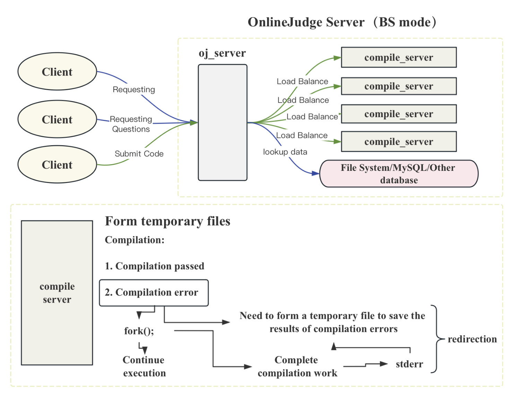

# Load-balanced-online-OJ-system

<a href="https://github.com/ffengc">
    
</a>
<a href="https://ffengc.github.io">
    
</a>
<a href="https://ffengc.github.io/gh-blog/">
    
</a>


- [简体中文](./README-CN.md)
- [English](./README.md)

> [!NOTE]
> 如果你对本项目的运行和实现有任何疑问，或者对本项目有更好的优化建议，可以直接联系我，或者在仓库的issue中留言。

- [Load-balanced-online-OJ-system](#load-balanced-online-oj-system)
  - [项目基本信息](#项目基本信息)
  - [项目模块架构](#项目模块架构)
  - [项目运行效果](#项目运行效果)
  - [配置运行](#配置运行)
    - [安装 Boost 库](#安装-boost-库)
    - [安装 JsonCpp](#安装-jsoncpp)
    - [安装 Ctemplate](#安装-ctemplate)
    - [克隆仓库并运行项目](#克隆仓库并运行项目)
    - [配置cr主机](#配置cr主机)
    - [修改/调整题目](#修改调整题目)
  - [项目实现细节](#项目实现细节)


## 项目基本信息

**项目名称：** 自制在线编程判题系统（Online Judge）

**项目描述：** 该项目旨在创建一个类似于LeetCode的在线编程判题系统，允许用户在浏览器中编写代码，提交并实时评估其代码的正确性和性能。系统支持多种编程语言，并能够提供即时反馈和详细的错误分析。

**核心功能：**
- 题目浏览与编码： 用户可以浏览题库中的题目，每道题都有对应的描述、示例和初始代码框架。
- 代码编辑与实时评估： 使用Ace编辑器在浏览器中编辑代码，支持基本的语法高亮和代码补全。
- 代码提交与判题： 用户提交的代码会被发送到服务器进行编译和执行，服务器会根据预设的测试用例来评估代码的正确性和效率。
- 负载均衡： 使用自定义的负载均衡算法智能选择最低负载的服务器进行代码编译和执行，以优化资源使用和响应时间。
- 结果反馈： 用户可以接收到详细的执行结果反馈，包括执行输出、错误信息和性能指标。

**技术栈：**

- 前端: HTML, CSS, JavaScript（使用Ace编辑器）
- 后端: C++, Boost库, JSON for Modern C++, ctemplate（用于HTML模板渲染）
- 服务器通信: 使用cpp-httplib库处理HTTP请求
- 数据存储: 题目和用户代码使用文件系统存储
- 负载均衡: 自主实现的负载均衡算法，基于当前活跃的服务器负载情况智能分配请求

**项目亮点：**
- 自主开发的负载均衡系统： 利用简单的负载监测和动态服务器选择机制，优化了系统的资源分配和处理速度。
- 完全自定义的编码环境： 集成的Ace代码编辑器提供了与桌面IDE相似的编码体验，包括语法高亮、代码折叠和自动补全。
- 模块化设计： 项目高度模块化，明确分离前端显示、后端逻辑处理和数据管理，便于维护和扩展。
- 广泛的技术应用： 结合现代C++的高级特性和多个开源库，展示了在实际应用中跨语言和框架的融合使用。


## 项目模块架构



## 项目运行效果

<div align="center">

https://github.com/user-attachments/assets/de89c038-8551-4ab0-88d9-4cdd4c84db8b

</div>

## 配置运行

### 安装 Boost 库

**在 Ubuntu 上安装:**

打开终端。
输入以下命令更新系统的包索引：
```
sudo apt update
```
安装 Boost 库：
```
sudo apt install libboost-all-dev
```

**在 CentOS 上安装:**

打开终端。
首先安装 EPEL 仓库以确保所有的依赖都可以找到：
```
sudo yum install epel-release
```
安装 Boost 库：
```
sudo yum install boost-devel
```

### 安装 JsonCpp

**在 Ubuntu 上安装:**

打开终端。
更新系统的包索引：
```
sudo apt update
```
安装 JsonCpp：
```
sudo apt install libjsoncpp-dev
```

**在 CentOS 上安装:**

1. 打开终端。
2. 确保已安装 EPEL 仓库，然后安装 JsonCpp：
```
sudo yum install jsoncpp-devel
```

### 安装 Ctemplate

**在 Ubuntu 上安装:**

打开终端。
更新系统的包索引：
```
sudo apt update
```
安装 Ctemplate：
```
sudo apt install libctemplate-dev
```

**在 CentOS 上安装:**

打开终端。
安装 Ctemplate：
```
sudo yum install ctemplate
```
### 克隆仓库并运行项目

```sh
git clone https://github.com/ffengc/Load-balanced-online-OJ-system.git;
cd Load-balanced-online-OJ-system/online_judge;
make clean;make;
```

设置环境变量:
```sh
export LD\_LIBRARY\_PATH=$LD\_LIBRARY\_PATH:/usr/local/lib # set the env
```

运行 `oj_server`:

```sh
cd oj_server;
./oj_server
```

运行 `compile_server`:

```sh
cd compile_server;
./compile_server 8081
```

### 配置cr主机

配置文件: `online_judge/oj_server/conf/service_machine.conf`

```conf
127.0.0.1:8081
127.0.0.1:8082
127.0.0.1:8083
```

### 修改/调整题目

目录: `online_judge/oj_server/questions`

按照目录中的格式配置即可。

## 项目实现细节

- **[work.md](./Work.md)**