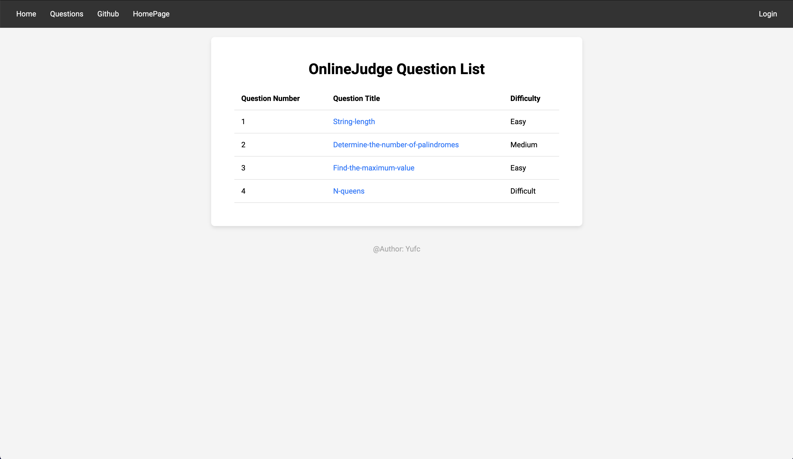
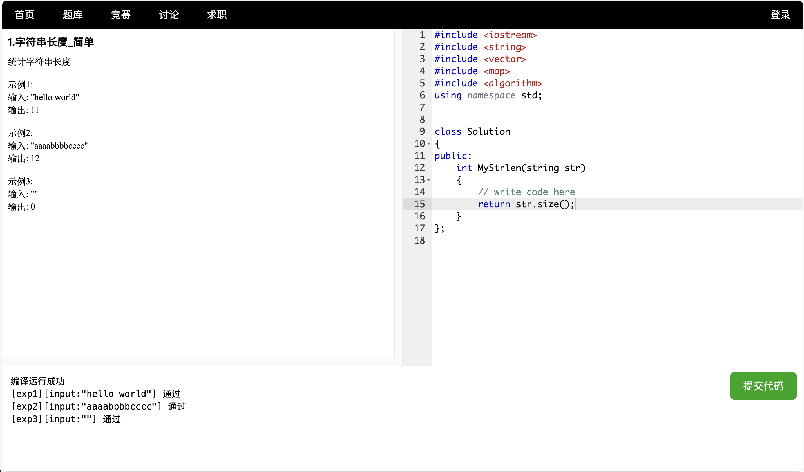
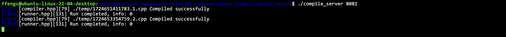
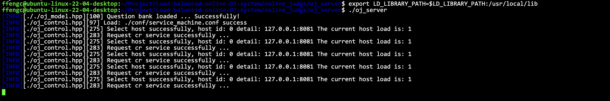
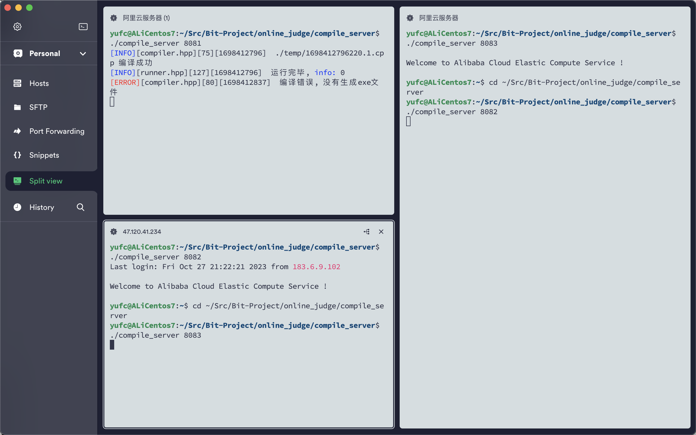
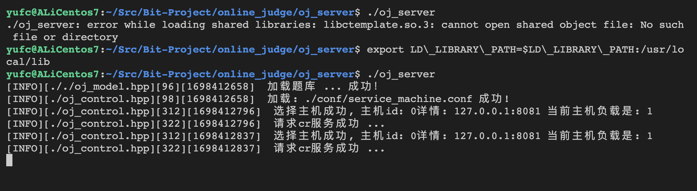
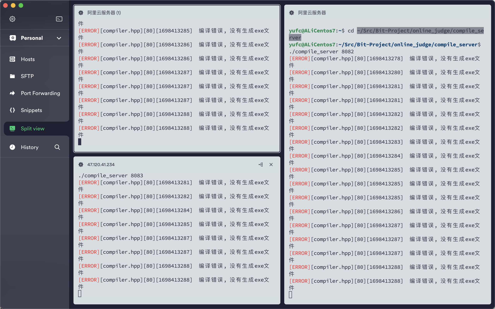
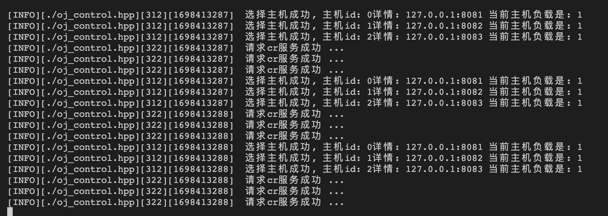
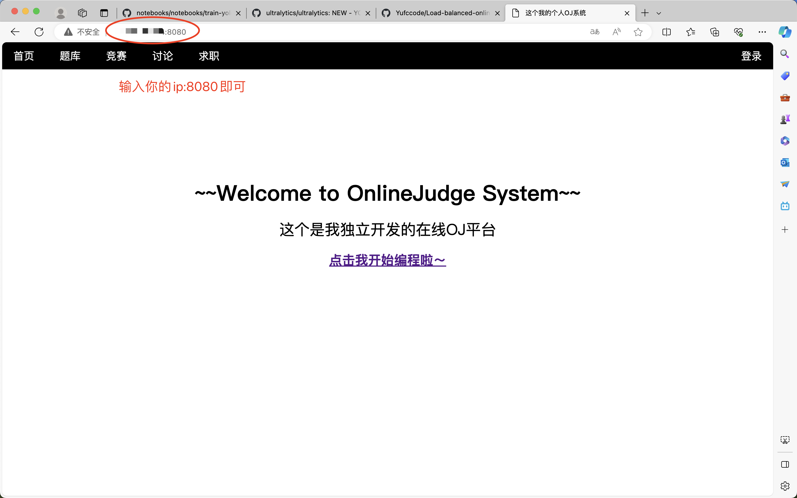

# Load-balanced-online-OJ-system

## 负载均衡OJ系统

这是一个负载均衡的OJ系统项目

代码的实现细节可见

- **[./Work.md](./Work.md)**

## 1. 项目简介

实现类似leetcode的在线编程系统。

后台可以部署多台编译服务主机（cr主机），然后oj_server服务将通过算法将大量的提交请求负载均衡地部署到每台cr主机上。如果后台有cr主机挂掉了，oj_server也能正确识别。

架构如下。


## 2. 所用技术和开发环境

**所用技术**

> C++STL、Boost准标准库、cpp-httplib第三方开源网络库、ctemplate第三方开源前端网页渲染库、jsoncpp第三方序列化反序列化库、负载均衡设计、分布式系统、多进程多线程控制、Mysql C Connect、Ace前端在前编辑器、html/css/js/jquery/ajax

**开发环境**

- centos服务器
- vscode

## 3. 项目运行展示

### 3.1 页面展示

主页。


题目列表（可继续增加题目）



答题界面。



答案/编译出现错误样例。



代码补全。



### 3.2 后端展示

编译服务后端。



oj服务后端。



瞬间多次提交，查看负载均衡情况。





可以看到oj_server是可以很好的实现负载均衡的，每一台后台主机都能得到请求。

## 4. 下载和运行方法

### 4.1 运行

克隆仓库。

```bash
git clone https://github.com/Yufccode/Load-balanced-online-OJ-system.git
```

进入仓库。

```
cd Load-balanced-online-OJ-system
```

编译生成可执行。

```bash
make
```

此时在oj_server目录下和compile_server目录下已经分别有一个可执行了。

然后分别在三个命令行下启动compile_server，然后在第四个命令行下启动oj_server

```bash
# 三个命令行分别执行这三个
./compile_server 8081
./compile_server 8082
./compile_server 8083
```

```bash
./oj_server # 第四个命令行执行这个命令
```

在浏览器浏览访问8080端口即可。



如果是云服务器记得放开防火墙，否则也无法访问。

### 4.2 增加/调整cr服务的主机或把cr服务部署到远端

现在默认是三台cr服务的主机。可以增加，修改配置文件就行了。

```
./oj_server/conf/service_machine.conf
```

```
127.0.0.1:8081
127.0.0.1:8082
127.0.0.1:8083
```

改里面的配置就行了，很简单，如果要部署到远端就改成你远端的ip就行了，然后如果要增加主机的话直接在后面接着加上去即可。

### 4.3 发布项目

调用最上级目录的`makefile`文件即可。

```bash
make
```

make之后就会有一个`make_output`目录，里面就是要发布的内容。

## 5. 增加题目的方法

所以题目的信息都存储在这目录下。

```
./oj_server/questions
```

目录结构如下所示。

```
.
├── 1
│   ├── desc.txt
│   ├── header.cpp
│   └── tail.cpp
├── 2
│   ├── desc.txt
│   ├── header.cpp
│   └── tail.cpp
├── 3
│   ├── desc.txt
│   ├── header.cpp
│   └── tail.cpp
├── 4
│   ├── desc.txt
│   ├── header.cpp
│   └── tail.cpp
└── question.list

4 directories, 13 files
```

question.list格式。

```
1 字符串长度 简单 1 30000
2 判断回文数 中等 1 30000
3 求最大值 简单 1 30000
4 N皇后 困难 1 30000
```

每一列分别是，题目列表，题目名称，难度，cpu运行时间限制，内存使用限制。

每一个以数字为名字的文件夹代表每一个题目的详细信息。

`desc.txt`是题目描述和一些详细信息。

`header.cpp`是展示给用户的代码片段。

`tail.cpp`是后端用于测试的代码片段。

增加题目按照上述的格式进行添加即可。