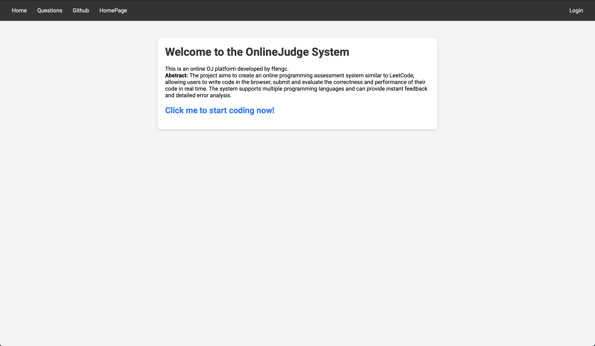
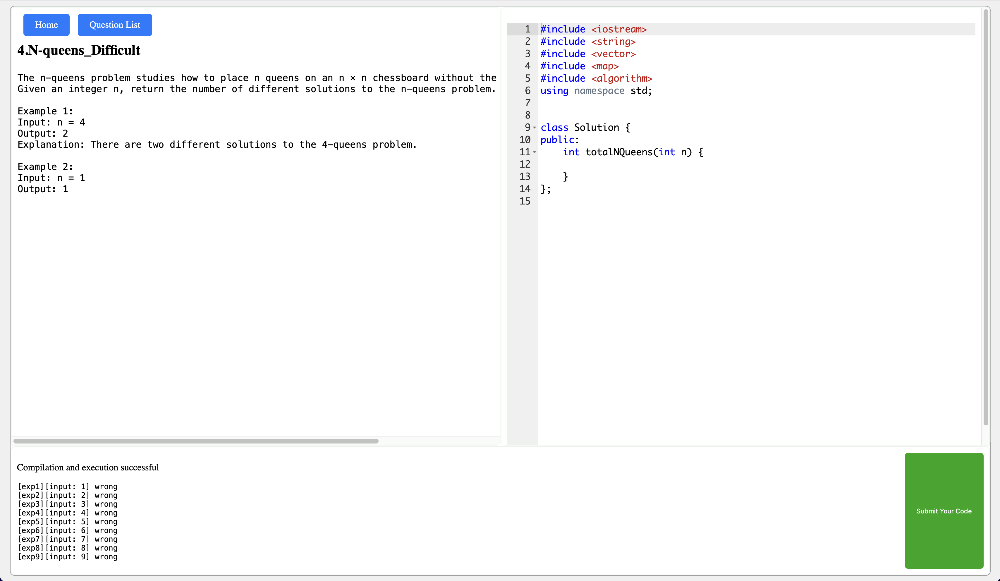

# Load-balanced-online-OJ-system


***

- **[简体中文](./README-CN.md)**
- **[English](./README.md)**

***

## Load-balanced-online-OJ-system

The detailed code details of the project implementation are shown in the following files.

- **[./Work.md](./Work.md)**

## 1. Project Description

Implement an online programming system similar to leetcode.

Multiple compilation service hosts (cr hosts) can be deployed in the background, and then the oj_server service will load-balancedly deploy a large number of submission requests to each cr host through algorithms. If the cr host in the background hangs up, oj_server can also correctly identify it.

The architecture is as follows.


## 2. Technologies and development environments used

**Technology used**

> C++STL, Boost quasi-standard library, cpp-httplib third-party open source network library, ctemplate third-party open source front-end web page rendering library, jsoncpp third-party serialization and deserialization library, load balancing design, distributed system, multi-process and multi-threading Control, Mysql C Connect, Ace front-end editor, html/css/js/jquery/ajax

**Development Environment**

- centos server
- vscode

## 3. Project operation display

### 3.1 Page display

Homepage.



题目列表（可继续增加题目）


Answer interface.



答案/编译出现错误样例。


代码补全。


### 3.2 Backend display

Compile service backend interface


oj service backend.


Submit multiple times instantly to check the load balancing situation.


It can be seen that oj_server can achieve load balancing very well, and every background host can get requests.

## 4. How to download and run

### 4.1 run

clone the repo。

```bash
git clone https://github.com/Yufccode/Load-balanced-online-OJ-system.git
```

enter the repo。

```
cd Load-balanced-online-OJ-system;
cd online_judge
```

Compile to generate executable。

```bash
make
```

At this time, there is already an executable in the oj_server directory and compile_server directory respectively.。

Then start compile_server under three command lines, and then start oj_server under the fourth command line.

```bash
# Three command lines execute these three respectively
./compile_server 8081
./compile_server 8082
./compile_server 8083
```

```bash
export LD\_LIBRARY\_PATH=$LD\_LIBRARY\_PATH:/usr/local/lib # set the env
./oj_server # The fourth command line executes this command
```

Just browse to port 8080 in your browser.


If it is a cloud server, remember to open the firewall, otherwise it will not be accessible.

### 4.2 Add/adjust the host of the cr service or deploy the cr service to the remote end

The default is now three cr service hosts. You can add it and just modify the configuration file.

```
./oj_server/conf/service_machine.conf
```

```
127.0.0.1:8081
127.0.0.1:8082
127.0.0.1:8083
```

Just change the configuration inside. It's very simple. If you want to deploy to the remote end, just change it to your remote IP. Then if you want to add a host, just add it directly later.

### 4.3 publish project

Just call the `makefile` file in the top directory.

```bash
make
```

After make, there will be a `make_output` directory, which contains the content to be published.

## 5. How to add questions

So the question information is stored in this directory.

```
./oj_server/questions
```

The directory structure is shown below.

```
.
├── 1
│   ├── desc.txt
│   ├── header.cpp
│   └── tail.cpp
├── 2
│   ├── desc.txt
│   ├── header.cpp
│   └── tail.cpp
├── 3
│   ├── desc.txt
│   ├── header.cpp
│   └── tail.cpp
├── 4
│   ├── desc.txt
│   ├── header.cpp
│   └── tail.cpp
└── question.list

4 directories, 13 files
```

question.list format.

```
1 字符串长度 简单 1 30000
2 判断回文数 中等 1 30000
3 求最大值 简单 1 30000
4 N皇后 困难 1 30000
```

Each column is the question list, question name, difficulty, CPU running time limit, and memory usage limit.

Each folder named with a number represents detailed information for each topic.

`desc.txt` is the topic description and some detailed information.

`header.cpp` is the code snippet displayed to the user.

`tail.cpp` is the code snippet used by the backend for testing.

To add questions, just follow the above format.
