# Load-balanced Online OJ System

***

- **[简体中文](./Work-CN.md)**
- **[English](./Work.md)**

***

Project start date: October 14, 2023

- [负载均衡OJ系统](#负载均衡oj系统)
  - [1. 项目简介](#1-项目简介)
  - [2. 所用技术和开发环境](#2-所用技术和开发环境)
  - [3. 项目准备工作](#3-项目准备工作)
    - [3.1 项目目录结构](#31-项目目录结构)
    - [3.2 项目宏观结构](#32-项目宏观结构)
    - [3.3 编写顺序](#33-编写顺序)
  - [4. 编译服务设计](#4-编译服务设计)
    - [4.1 准备工作](#41-准备工作)
    - [4.2 主要结构编写](#42-主要结构编写)
    - [4.3 PathUtil工具编写](#43-pathutil工具编写)
    - [4.4 继续编写主结构](#44-继续编写主结构)
  - [5. 日志功能编写](#5-日志功能编写)
  - [6. 运行功能](#6-运行功能)
  - [7. 测试运行模块](#7-测试运行模块)
  - [8. 初识资源限制](#8-初识资源限制)
    - [8.1 限制时间](#81-限制时间)
    - [8.2 限制内存大小](#82-限制内存大小)
    - [8.3 进程时如何被终止的？](#83-进程时如何被终止的)
    - [8.4 给runner设置资源限制](#84-给runner设置资源限制)
  - [9. complie\_run模块编写](#9-complie_run模块编写)
    - [9.1 基本框架理解](#91-基本框架理解)
    - [9.2 安装和认识jsoncpp](#92-安装和认识jsoncpp)
    - [9.3 cr模块-1](#93-cr模块-1)
    - [9.4 cr模块-2](#94-cr模块-2)
    - [9.5 cr模块-3](#95-cr模块-3)
      - [9.5.1 `CodeToDesc()`](#951-codetodesc)
      - [9.5.2 `UniqFileName()`](#952-uniqfilename)
      - [9.5.3 `WriteFile()`和`ReadFile()`](#953-writefile和readfile)
    - [9.6 对代码进行测试](#96-对代码进行测试)
    - [9.7 收尾工作](#97-收尾工作)
    - [9.8 形成网络服务](#98-形成网络服务)
      - [9.8.1 cpp-httplib第三方网络库](#981-cpp-httplib第三方网络库)
      - [9.8.2 建立Post方法](#982-建立post方法)
      - [9.8.3 使用postman进行综合测试](#983-使用postman进行综合测试)
  - [10. oj\_server准备工作](#10-oj_server准备工作)
    - [10.1 oj\_server准备工作](#101-oj_server准备工作)
    - [10.2 把文件目录准备好](#102-把文件目录准备好)
    - [10.3 先把网络路由功能写好](#103-先把网络路由功能写好)
    - [10.4 设计题库（文件版）](#104-设计题库文件版)
  - [11. 构建model部分代码](#11-构建model部分代码)
    - [11.1 搭建model的框架](#111-搭建model的框架)
    - [11.2 编写model代码](#112-编写model代码)
    - [11.3 安装boost库](#113-安装boost库)
    - [11.4 使用boost库来完成字符串切割方法](#114-使用boost库来完成字符串切割方法)
  - [12. 编写control模块的基础结构](#12-编写control模块的基础结构)
  - [13. 认识ctemplate前端渲染库](#13-认识ctemplate前端渲染库)
    - [13.1 安装ctemplate](#131-安装ctemplate)
    - [13.2 基本使用](#132-基本使用)
    - [13.3 编写view模块](#133-编写view模块)
    - [13.4 准备一些前端文件](#134-准备一些前端文件)
    - [13.5 获取题目列表](#135-获取题目列表)
    - [13.6 获取单个题目](#136-获取单个题目)
  - [14. 编写负载均衡模块整体代码](#14-编写负载均衡模块整体代码)
    - [14.1 准备工作](#141-准备工作)
    - [14.2 编写负载均衡模块整体结构](#142-编写负载均衡模块整体结构)
    - [14.3 完善负载均衡模块代码](#143-完善负载均衡模块代码)
      - [14.3.1 加载配置文件](#1431-加载配置文件)
      - [14.3.2 智能选择主机](#1432-智能选择主机)
    - [14.4 Judge编写1](#144-judge编写1)
    - [14.5 OfflineMachine](#145-offlinemachine)
    - [14.6 OnlineMachine](#146-onlinemachine)
    - [14.7 Postman测试](#147-postman测试)
  - [15. 前端部分编写](#15-前端部分编写)
    - [15.1 准备知识](#151-准备知识)
    - [15.2 开始操作](#152-开始操作)
    - [15.3 首页](#153-首页)
    - [15.4 题目列表](#154-题目列表)
    - [15.5 Ace在线编辑器构建单个题目列表（直接复制粘贴即可）](#155-ace在线编辑器构建单个题目列表直接复制粘贴即可)
  - [16. 综合调试](#16-综合调试)
    - [16.1 解决题目列表乱序问题](#161-解决题目列表乱序问题)
    - [16.2 解决当所有主机离线了，然后同上线的问题](#162-解决当所有主机离线了然后同上线的问题)
  - [17. 结项](#17-结项)
    - [17.1 项目扩展思路](#171-项目扩展思路)
    - [17.2 Makefile的整体构建](#172-makefile的整体构建)


## 1. Project Introduction

Implement an online programming system similar to LeetCode.

## 2. Technologies and Development Environment

**Technologies Used**

> C++ STL, Boost quasi-standard library, cpp-httplib third-party open source network library, ctemplate third-party open source frontend page rendering library, jsoncpp third-party serialization/deserialization library, load balancing design, distributed system, multi-process and multi-threading control, MySQL C Connect, Ace frontend editor, html/css/js/jquery/ajax

**Development Environment**

- CentOS server
- VSCode

***

Let's start development.

## 3. Project Preparation

### 3.1 Project Directory Structure

First, prepare the directory structure.

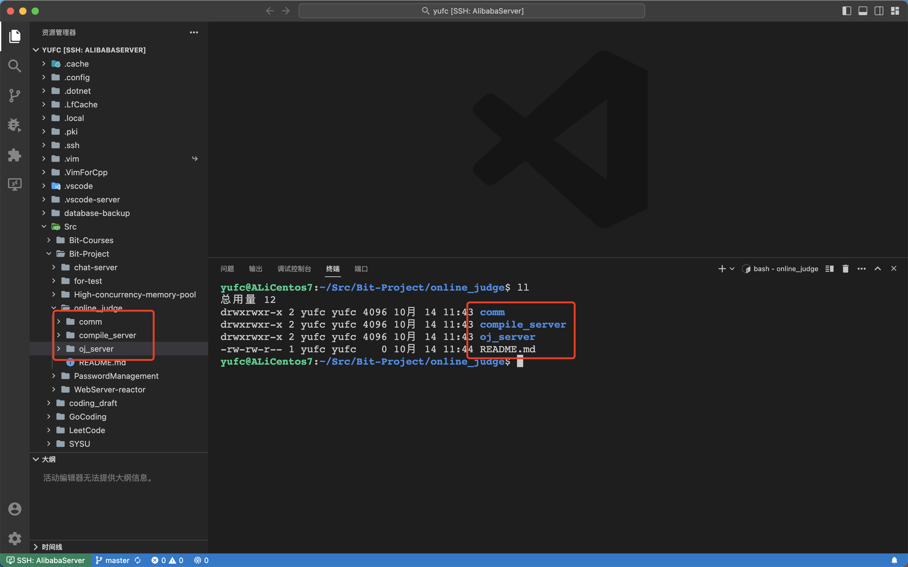

> 1. comm: Common module
> 2. compile_server: Compilation and execution module
> 3. oj_server: Get problem list, view problems, coding interface, load balancing, and other features

### 3.2 Project Macro Architecture

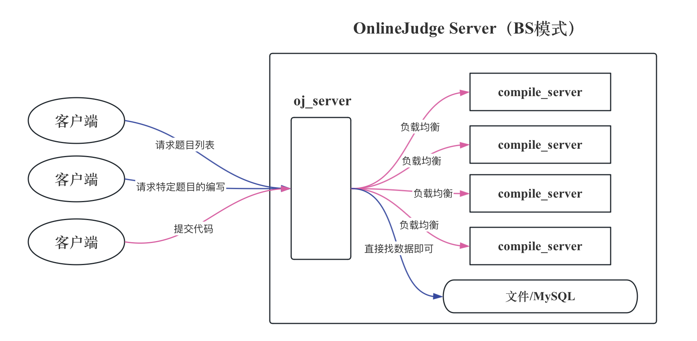

**If the client only requests the problem list or a specific problem's editing page, we just need to query the database directly.**

**But if the client submits code, we need to use the load-balanced distributed algorithm to route to the compilation module.**

### 3.3 Development Order

1. First, write the compile_server
2. Then write the oj_server
3. Write version 1: file-based system
4. Introduce frontend page design
5. Write version 2: database-based system

## 4. Compilation Service Design

### 4.1 Preparation

The service provided is: compile our code, run the code, and get formatted results.

First, set up the required files.

```bash
yufc@ALiCentos7:~/Src/Bit-Project/online_judge/compile_server$ tree .
.
├── compiler.hpp
├── compile_run.hpp
├── compile_server.cc
├── makefile
└── runner.hpp

0 directories, 5 files
yufc@ALiCentos7:~/Src/Bit-Project/online_judge/compile_server$
```

Let's write `compiler.hpp` first.

We assume there is already a source code file (temporary file), and this compiler.hpp will compile that temporary file.

Of course, when compiling, there are only two possible outcomes:

1. Compilation succeeds
2. Compilation fails

Therefore, after a compilation error, the error information needs to be saved in a temporary file. Originally it would go to the display, but now it needs to be shown to the user — this is called redirection!

Also, compilation should not be done by our process itself; it should be done by a forked child process.

So we can draw the overall structure of the compilation service.

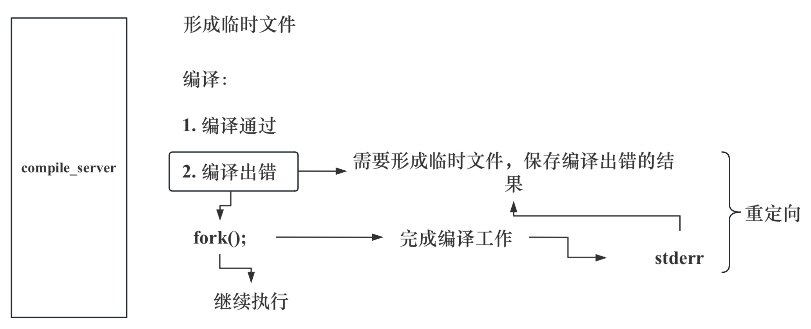

Then we can start writing.

### 4.2 Main Structure Implementation

Use a core function `static bool Compile(const std::string &file_name)` to perform the compilation work.

The input is the temporary file we mentioned.

```cpp
#ifndef __YUFC_COMPILER_HPP__
#define __YUFC_COMPILER_HPP__
#include <iostream>
#include <algorithm>
#include <unistd.h>
// Only responsible for code compilation
namespace ns_compiler
{
    class Compiler
    {
    public:
        Compiler() {}
        ~Compiler() {}
        static bool Compile(const std::string &file_name)
        {
            /*
                return value:
                true: compilation succeeded
                false: compilation failed
            */
            pid_t child_pro_pid = fork();
            if (child_pro_pid < 0)
            {
                return false; // compilation failed
            }
            else if (child_pro_pid == 0)
            {
                // Child process: call the compiler to complete the code compilation
            }
          	// ...
        }
    };
}

#endif
```

Then after calling the child process, we use the exec family of functions to perform the operation.

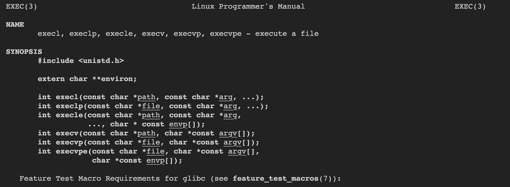

Since we are only calling `g++` here, which is definitely in the system path, we should choose one with 'p'. Here we choose `execlp` for program replacement.

Now the issue is that during the compilation process, many temporary files will be generated. Whether it's the correct source file, error information, or something else, we need to keep track of them, so let's create a temp directory.

```bash
yufc@ALiCentos7:~/Src/Bit-Project/online_judge/compile_server$ mkdir temp
yufc@ALiCentos7:~/Src/Bit-Project/online_judge/compile_server$ tree .
.
├── compiler.hpp
├── compile_run.hpp
├── compile_server.cc
├── makefile
├── runner.hpp
└── temp

1 directory, 5 files
yufc@ALiCentos7:~/Src/Bit-Project/online_judge/compile_server$
```

```cpp
/*
    We assume that the incoming file_name has no suffix
    So: file_name: 1234
    1234 -> ./temp/1234.cpp
    1234 -> ./temp/1234.exe
    1234 -> ./temp/1234.stderr
*/
```

Since we may need some string operations, we create `util.hpp` in the comm directory for common utilities.

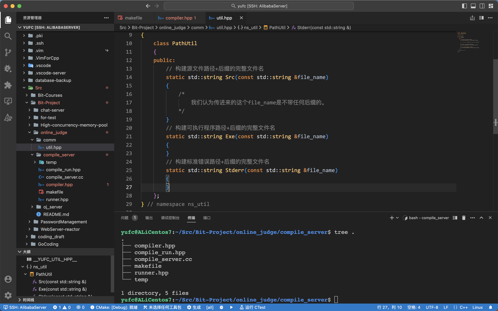

After that, call the exec replacement function.

```cpp
execlp("g++", "-o", PathUtil::Exe(file_name).c_str(), PathUtil::Src(file_name), "-std=c++11", nullptr); // Don't forget this nullptr
```

Now we can write those string handling utility functions first.

### 4.3 PathUtil Utility Implementation

```cpp
namespace ns_util
{
    const std::string temp_path_root = "./temp/"; // Global path
    class PathUtil
    {
    public:
        static std::string AddSuffix(const std::string &file_name, const std::string &suffix)
        {
            std::string path_name = temp_path_root;
            path_name += file_name;
            path_name += suffix;
            return path_name;
        }

    public:
        // Build the complete filename with source file path + suffix
        static std::string Src(const std::string &file_name)
        {
            /*
                We assume the incoming file_name has no suffix.
            */
            return AddSuffix(file_name, ".cpp");
        }
        // Build the complete filename with executable path + suffix
        static std::string Exe(const std::string &file_name)
        {
            return AddSuffix(file_name, ".exe");
        }
        // Build the complete filename with stderr path + suffix
        static std::string Stderr(const std::string &file_name)
        {
            return AddSuffix(file_name, ".stderr");
        }
    };
} // namespace ns_util
```

That's enough for now.

Then we can continue writing the main structure.

### 4.4 Continue Writing the Main Structure

Now the `Compile` function looks like this:

```cpp
static bool Compile(const std::string &file_name)
{
    /*
        return value:
        true: compilation succeeded
        false: compilation failed
    */
    /*
        We assume that the incoming file_name has no suffix
        So: file_name: 1234
        1234 -> ./temp/1234.cpp
        1234 -> ./temp/1234.exe
        1234 -> ./temp/1234.stderr
    */
    pid_t child_pro_pid = fork();
    if (child_pro_pid < 0)
    {
        return false; // compilation failed
    }
    else if (child_pro_pid == 0)
    {
        // Child process: call the compiler to complete the code compilation
        // g++ -o target src -std=c++11
        execlp("g++", "-o", PathUtil::Exe(file_name).c_str(), \
               PathUtil::Src(file_name), "-std=c++11", nullptr); // Don't forget this nullptr
    }
  	else
    {
      	// ...
    }
}
```

Let's continue writing. Since we called execlp, we need to know the result of the program execution, so we definitely need to wait.

After calling `waitpid()`, how do we determine if compilation was successful?

We can check by verifying whether the file exists.

If `1234.exe` exists, it means compilation was successful. And so on.

```cpp
else
{
    waitpid(child_pro_pid, nullptr, 0);
    // Was compilation successful?
    if(FileUtil::IsFileExists(PathUtil::Exe(file_name)))
    {
        return true;
    }
}
```

`IsFileExists` can be placed in `Util` for management.

```cpp
class FileUtil
{
public:
    static bool IsFileExists(const std::string &path_name)
    {
    }
};
```

How do we check if a file exists? You could use the file-open approach — if the file opens successfully, the file exists. This method works but is a bit crude. Let's use another approach.

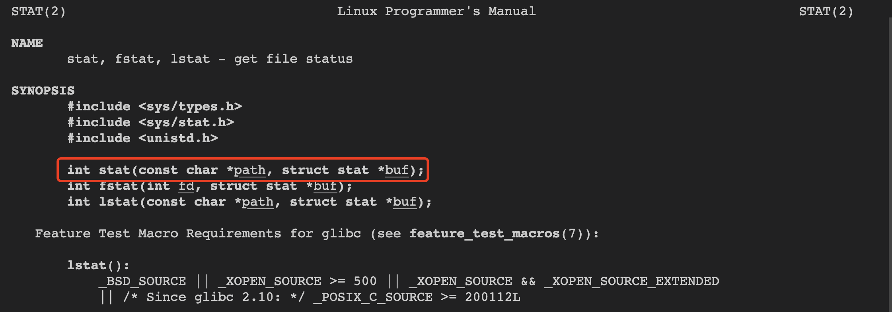

This function can get the attributes of a file at a given path.

`buf` is an output parameter containing the file attributes. We don't need to worry about it.

The return value is an `int`. If getting the attributes succeeds, it returns 0; if it fails, it returns -1.

```cpp
class FileUtil
{
public:
    static bool IsFileExists(const std::string &path_name)
    {
        struct stat st;
        if (stat(path_name.c_str(), &st) == 0)
        {
            // Successfully got file attributes
            return true;
        }
        return false;
    }
};
```

This part is mostly done now.

But what about error information? We need to redirect the error information, so let's do that now.

Originally, error information was supposed to be printed to file descriptor 2. Now we redirect it to our file's file descriptor.

Just use `dup2()`.

```cpp
 else if (child_pro_pid == 0)
{
    // Redirect error information
    int fd_stderr = open(PathUtil::Stderr(file_name).c_str(), O_CREAT | O_WRONLY, 644);
    if (fd_stderr < 0)
    {
        exit(1);
    }
    // Redirect stderr to fd_stderr
    dup2(fd_stderr, 2);

    // Child process: call the compiler to complete the code compilation
    // g++ -o target src -std=c++11
    execlp("g++", "g++", "-o", PathUtil::Exe(file_name).c_str(),
           PathUtil::Src(file_name).c_str(), "-std=c++11", nullptr); // Don't forget this nullptr
    exit(1);
}
```

**Note: Program replacement does not affect the process's file descriptor table.**

But there's an issue! When an error occurs, we're currently returning directly, but ideally we should be logging. So in the next section, let's write the logging functionality first.

## 5. Log Module Implementation

This is quite simple and easy to understand. Here's the main structure code first.

```cpp
namespace ns_log
{
    using namespace ns_util;
    enum // Log levels
    {
        INFO,
        DEBUG,
        WARNING,
        ERROR,
        FATAL
    };
    // Log() << "message"
    std::ostream &Log(const std::string &level, const std::string &file_name, int line)
    {
        // Add log level
        std::string message = "[";
        message += level;
        message += "]";
        // Add error file name
        message += "[";
        message += file_name;
        message += "]";
        // Add error line
        message += "[";
        message += std::to_string(line);
        message += "]";
        // Log timestamp
        message += "[";
        message += TimeUtil::GetTimeStamp();
        message += "]";

        // cout internally contains a buffer
        std::cout << message; // Don't use endl to flush

        return std::cout;
    }
}
```

But we don't want to call it with so many parameters in the future. We want `LOG(level) << "hello"` to work, so we define a macro.

```cpp
#define LOG(level) Log(#level, __FILE__, __LINE__);
```

The code for getting the time is as follows.

```cpp
class TimeUtil
{
public:
    static std::string GetTimeStamp()
    {
        struct timeval __time;
        gettimeofday(&__time, nullptr);
        return std::to_string(__time.tv_sec);
    }
};
```

That works.

## 6. Run Module

Now we can successfully obtain an executable, so now we need to execute it.

```cpp
#ifndef __YUFC_RUNNER__
#define __YUFC_RUNNER__
#include <iostream>
#include <string>
namespace ns_runner
{
    class Runner
    {
    public:
        Runner() {}
        ~Runner() {}
    public:
        // Just specify the file name, no need to include the path
        static int Run(const std::string& file_name)
        {

        }
    };
}
#endif
```

First, we definitely need to `fork()`.

**Some important points:**

> After the program finishes running:
>
> 1. Code runs to completion, result is correct
>
> 2. Code runs to completion, result is incorrect
>
> 3. Code doesn't finish running, exception occurs
>
> Does Run need to consider whether the result is correct or not? No!
>
> Whether the result is correct is determined by the test cases!
>
> So this part only considers whether the code ran to completion correctly.
>
> Also, we need to know who the executable is.
>
> When a program starts by default:
>
> - Standard input: not handled, self-test scenario not considered
>
> - Standard output: the output result after the program finishes running
>
> - Standard error: runtime error information (different from compilation errors)
>
> We want all three outputs to be redirectable to files.

So we need to distinguish between compile-time errors and runtime errors.

So let's rename the Stderr in Util from earlier.

```cpp
static std::string CompilerError(const std::string &file_name)
{
    return AddSuffix(file_name, ".compile_error");
}
```

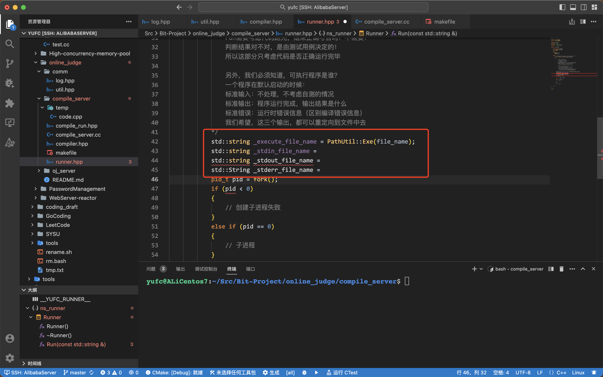

Here we need to print runtime information, so we need log files for stdin, stdout, and stderr with the same name.

So we can add more to PathUtil.

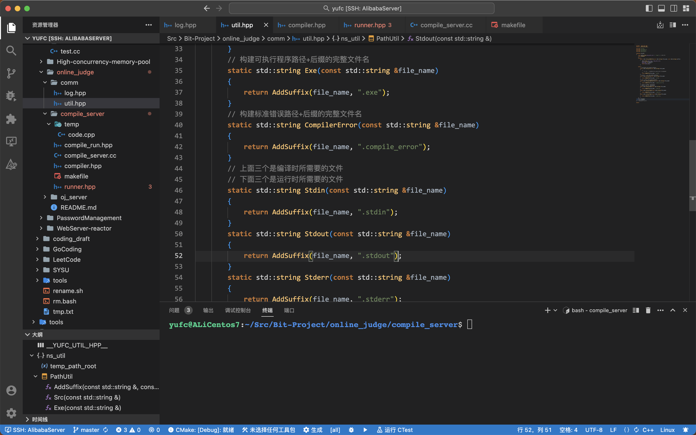

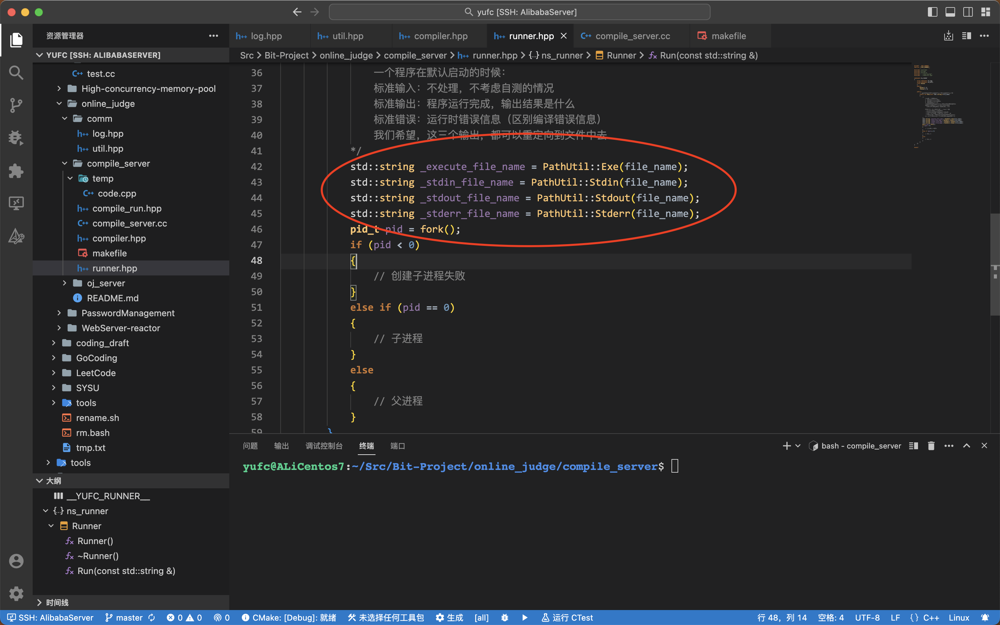

Open these files:

```cpp
// Open these files
umask(0);
int _stdin_fd = open(_stdin_file_name.c_str(), O_CREAT | O_RDONLY, 0777);
int _stdout_fd = open(_stdout_file_name.c_str(), O_CREAT | O_WRONLY, 0777);
int _stderr_fd = open(_stderr_file_name.c_str(), O_CREAT | O_WRONLY, 0777);
```

Of course, we need to ensure the files are opened successfully.

```cpp
// Must ensure files are opened successfully
if (_stdin_fd < 0 || _stdout_fd < 0 || _stderr_fd < 0)
{
    // LOG() <<
    return -1; // Represents file open failure
}
```

The parent process doesn't care about these file descriptors; it just waits.

```cpp
else
{
    // Parent process
    // Parent process doesn't care about these file descriptors
    close(_stdin_fd);
    close(_stdout_fd);
    close(_stderr_fd);
    int status = 0;
    waitpid(pid, &status, 0);
}
```

Child process:

```cpp
else if (pid == 0)
{
    // Child process
    // Perform three redirections
    dup2(_stdin_fd, 0);
    dup2(_stdout_fd, 1);
    dup2(_stderr_fd, 2);

    execlp(_execute_file_name.c_str(), _execute_file_name.c_str(), nullptr);
    exit(1); // If an error occurs, it will reach here, set to 1
}
```

But now there's a question: how do we know if the system encountered an exception?

If a program crashes, it must have received a signal.

```cpp
else
{
    // Parent process
    // Parent process doesn't care about these file descriptors
    close(_stdin_fd);
    close(_stdout_fd);
    close(_stderr_fd);
    int status = 0;
    waitpid(pid, &status, 0);
    // If the program runs abnormally, it must be because it received a signal
    return status & 0x7F; // The final return here is the signal received by the child process
}
```

```cpp
/*
    return value: status & 0x7F
    >0 means the program encountered an exception, the child process received a signal
    The return value is the corresponding signal number!
    ==0 means normal execution completed, results are saved in temporary files,
    whether it passed the test cases is not our concern
    <0 means internal error (e.g., file open failure, child process creation failure)
*/
```

Add the logging.

## 7. Testing the Run Module

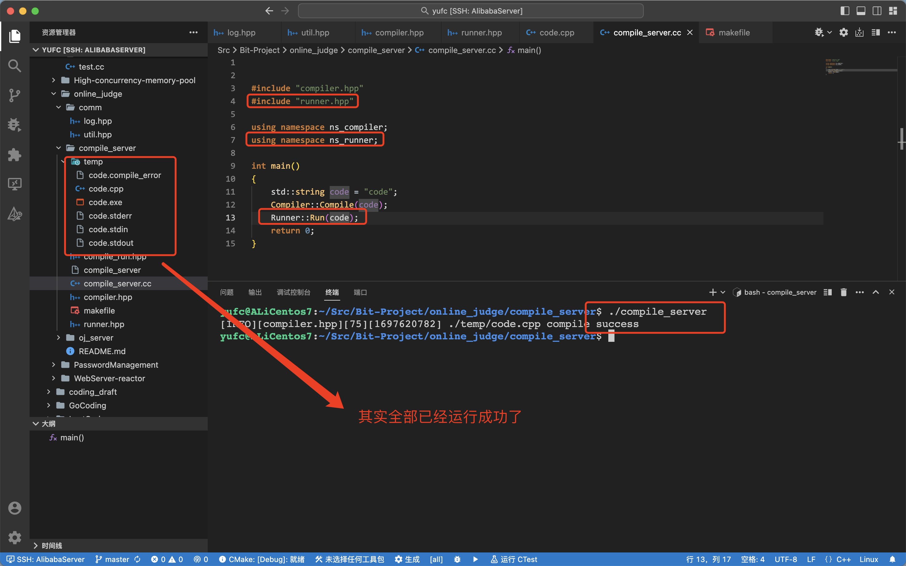

## 8. Introduction to Resource Limits

Let's learn a new Linux interface.

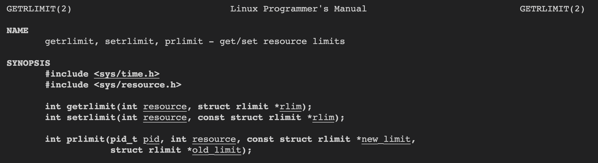

Create a `test.cc` in the `comm` directory to learn this interface.

### 8.1 Limiting Time

```cpp
#include <iostream>
#include <sys/time.h>
#include <sys/resource.h>
int main()
{
    // Limit runtime
    struct rlimit r;
    r.rlim_cur = 1;
    r.rlim_max = RLIM_INFINITY;
    setrlimit(RLIMIT_CPU, &r);
    while(1)
    {
        ;
    }
    return 0;
}
```


### 8.2 Limiting Memory Size

```cpp
int main()
{
    // Limit memory size
    struct rlimit r;
    r.rlim_cur = 1024*1024*40; // 20M
    r.rlim_max = RLIM_INFINITY;
    setrlimit(RLIMIT_AS, &r);
    int count = 0;
    while (true)
    {
        int *p = new int[1024*1024]; // Allocate 1MB at a time
        std::cout << "size: " << count++ << std::endl;
        sleep(1);
    }
    return 0;
}
```

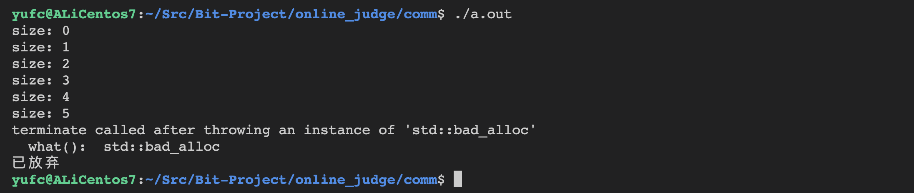

### 8.3 How is the Process Terminated?

Insufficient resources cause the OS to terminate the process via signals.

Now I'm curious — what signals do these two pieces of code receive respectively?

```cpp

#include <iostream>
#include <sys/time.h>
#include <sys/resource.h>
#include <unistd.h>
#include <signal.h>

void handler(int signo)
{
    std::cout <<"signo: " << signo << std::endl;
    exit(1);
}

int main()
{
    // Catch signals
    for (int i = 1; i <= 31; i++)
    {
        signal(i, handler);
    }
    // Limit runtime
#if false
    struct rlimit r;
    r.rlim_cur = 1;
    r.rlim_max = RLIM_INFINITY;
    setrlimit(RLIMIT_CPU, &r);
    while(1)
    {
        ;
    }
#endif

    // Limit memory size
    struct rlimit r;
    r.rlim_cur = 1024 * 1024 * 40; // 20M
    r.rlim_max = RLIM_INFINITY;
    setrlimit(RLIMIT_AS, &r);
    int count = 0;
    while (true)
    {
        int *p = new int[1024 * 1024]; // Allocate 1MB at a time
        std::cout << "size: " << count++ << std::endl;
        sleep(1);
    }
    return 0;
}
```

We can see that the memory issue actually receives signal 6.


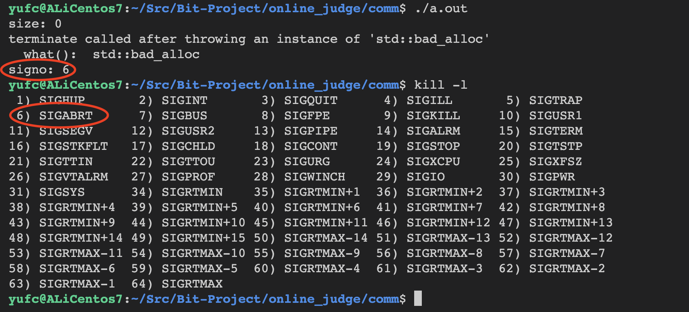

What about the time limit?

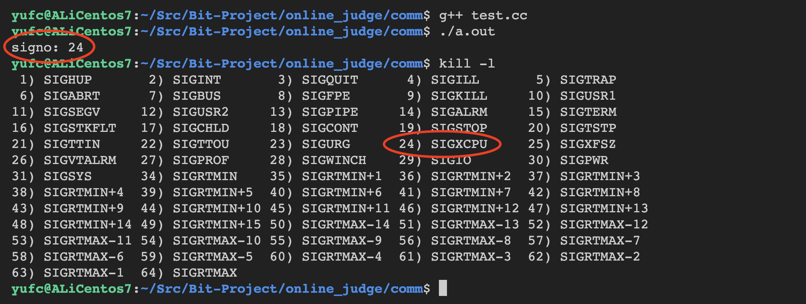

### 8.4 Setting Resource Limits for Runner

Set the limits here:

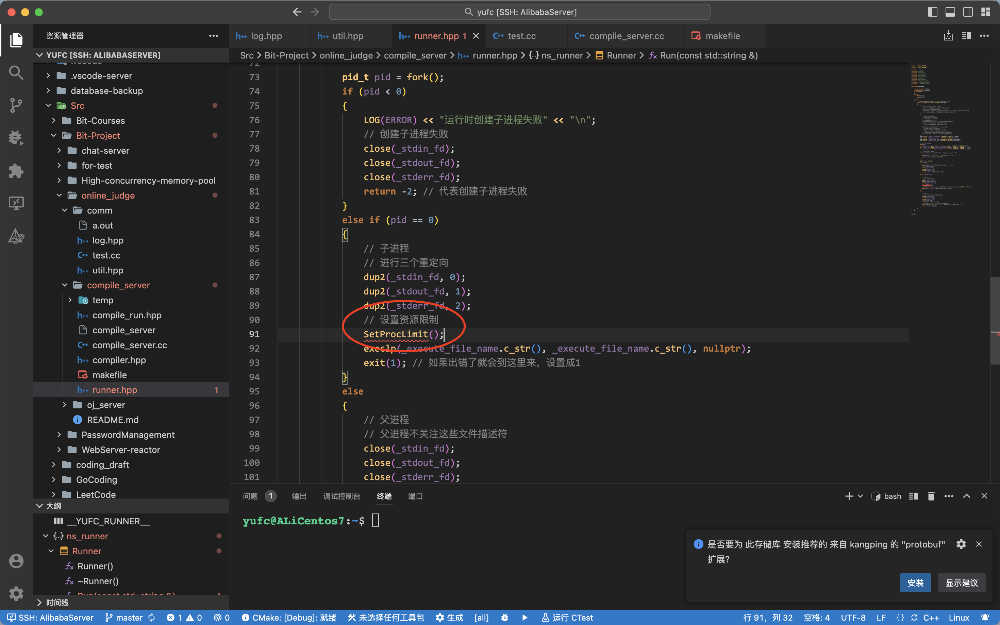

Of course, our `Run` method should ideally expose the limits we need.

So let's modify it:

```cpp
static int Run(const std::string &file_name, int cpu_limit, int mem_limit) {}
```

```cpp
static void SetProcLimit(int cpu_limit, int mem_limit)
{
    /* Provide an interface for setting process resource limits */
    /* mem_limit is in KB */
    struct rlimit cpu_rlimit;
    cpu_rlimit.rlim_max = RLIM_INFINITY;
    cpu_rlimit.rlim_cur = cpu_limit;
    setrlimit(RLIMIT_CPU, &cpu_rlimit);

    struct rlimit mem_rlimit;
    mem_rlimit.rlim_max = RLIM_INFINITY;
    mem_rlimit.rlim_cur = mem_limit * 1024; // Convert to KB
    setrlimit(RLIMIT_AS, &mem_rlimit);
}
```

## 9. compile_run Module Implementation

### 9.1 Basic Framework Understanding

This module, besides combining compile and run, most importantly adapts to user requests.

Note that this module is called by network services. A large number of users may work on the same problem simultaneously, so we need to generate unique file names.

Also, `compile_server.cc` should not see the `compile` module or the `run` module — it should only see the `compile_run` module. That's the correct approach.

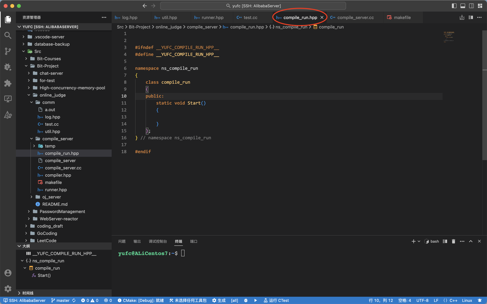

### 9.2 Installing and Understanding jsoncpp

```bash
sudo yum install jsoncpp-devel -y
```

Simple usage:

```cpp
#include <jsoncpp/json/json.h>
#include <string>
int main()
{
    // Serialization
    // Value is a JSON intermediate class that can hold key-value pairs
    Json::Value root;
    root["code"] = "mycode";
    root["user"] = "whb";
    root["age"] = "19";

    Json::StyledWriter writer;
    std::string str = writer.write(root);
    std::cout << str << std::endl;
    return 0;
}
```

You need to link a library when compiling:

```bash
g++ test.cc -std=c++11 -ljsoncpp
```

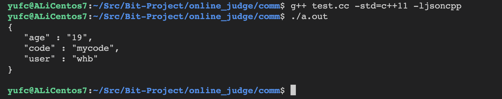

### 9.3 CR Module - Part 1

Now let's write the Start function.

```cpp
/*
    Input parameters:
        input: the input corresponding to the user's submitted code
        code: the user's submitted code, processed as-is
        cpu_limit: time requirement
        mem_limit: memory requirement
    Output parameters:
        status: status code
        reason: request result
        stdout: the output result of my program
        stderr: the error output after running
*/
static void Start(const std::string &in_json, const std::string *out_json)
{
    Json::Value in_value;
    Json::Reader reader;
    reader.parse(in_json, in_value); // Handle errors later
    // Code and input
    std::string code = in_value["code"].asString();
    std::string input = in_value["input"].asString(); // Not processed
    // Time limit and memory limit
    int cpu_limit = in_value["cpu_limit"].asInt();
    int mem_limit = in_value["mem_limit"].asInt();


    if (code.size() == 0)
    {
        // User didn't submit code
        // ...
    }
    // Generate a unique filename, then write the code to a temporary file
    std::string file_name = FileUtil::UniqFileName();
    FileUtil::WriteFile(PathUtil::Src(file_name), code); // Create temporary source file
    //
    Compiler::Compile(file_name);
    Runner::Run(file_name, cpu_limit, mem_limit);
}
```

This is roughly the skeleton. But there's still a lot to add, such as:

- Error handling at each step
- out hasn't been built yet

### 9.4 CR Module - Part 2

The input and output JSON roughly looks like this:

```cpp
/*
    in_json:
    {"code":"#include ...", "input":"", "cpu_limit":1, "mem_limit":10240}
    out_json:
    {"status":0, "reason":"", "stdout":"", "stderr":"", ...}
*/
```

Now we need to add some error handling.

We use `goto` statements.

```cpp
static void Start(const std::string &in_json, const std::string *out_json)
{
    Json::Value in_value;
    Json::Reader reader;
    reader.parse(in_json, in_value); // Handle errors later
    // Code and input
    std::string code = in_value["code"].asString();
    std::string input = in_value["input"].asString(); // Not processed
    // Time limit and memory limit
    int cpu_limit = in_value["cpu_limit"].asInt();
    int mem_limit = in_value["mem_limit"].asInt();

    // Variables cannot be defined in the goto jump range
    // Status code to return to the upper layer
    int status_code = 0;
    // Status code returned by Run
    int runner_rt_code = 0;
    // Unique filename
    std::string file_name;

    // Build the final JSON to return to the user
    Json::Value out_value;

    if (code.size() == 0)
    {
        status_code = -1; // File is empty
        goto END;
    }
    // Generate a unique filename, then write the code to a temporary file
    // We'll use millisecond-level timestamp + atomic incremental unique value to ensure uniqueness
    file_name  = FileUtil::UniqFileName();
    if (!FileUtil::WriteFile(PathUtil::Src(file_name), code)) // Create temporary source file
    {
        status_code = -2; // Unknown error
        goto END;
    }
    if (!Compiler::Compile(file_name))
    {
        status_code = -3; // Compilation error
        goto END;
    }
    runner_rt_code = Runner::Run(file_name, cpu_limit, mem_limit);
    if (runner_rt_code < 0)
    {
        status_code = -2; // Unknown error
        goto END;
    }
    else if(runner_rt_code > 0)
    {
        status_code = runner_rt_code; // Program crashed during execution
        goto END;
    }
    else
    {
        status_code = 0;
    }
    END:
    out_value["status"] = status_code;
    out_value['reason'] = ;
    if(status_code == 0)
    {
        // The entire process was successful
        out_value["stdout"] = ;
        out_value["stderr"] = ;
    }
}
```

The general framework is like this:

```cpp
static void Start(const std::string &in_json, std::string *out_json)
{
    Json::Value in_value;
    Json::Reader reader;
    reader.parse(in_json, in_value); // Handle errors later
    // Code and input
    std::string code = in_value["code"].asString();
    std::string input = in_value["input"].asString(); // Not processed
    // Time limit and memory limit
    int cpu_limit = in_value["cpu_limit"].asInt();
    int mem_limit = in_value["mem_limit"].asInt();

    // Variables cannot be defined in the goto jump range
    // Status code to return to the upper layer
    int status_code = 0;
    // Status code returned by Run
    int runner_rt_code = 0;
    // Unique filename
    std::string file_name;

    // Build the final JSON to return to the user
    Json::Value out_value;

    if (code.size() == 0)
    {
        status_code = -1; // File is empty
        goto END;
    }
    // Generate a unique filename, then write the code to a temporary file
    // We'll use millisecond-level timestamp + atomic incremental unique value to ensure uniqueness
    file_name = FileUtil::UniqFileName();
    if (!FileUtil::WriteFile(PathUtil::Src(file_name), code)) // Create temporary source file
    {
        status_code = -2; // Unknown error
        goto END;
    }
    if (!Compiler::Compile(file_name))
    {
        status_code = -3; // Compilation error
        goto END;
    }
    runner_rt_code = Runner::Run(file_name, cpu_limit, mem_limit);
    if (runner_rt_code < 0)
    {
        status_code = -2; // Unknown error
        goto END;
    }
    else if (runner_rt_code > 0)
    {
        status_code = runner_rt_code; // Program crashed during execution
        goto END;
    }
    else
    {
        status_code = 0;
    }
END:
    out_value["status"] = status_code;
    out_value['reason'] = CodeToDesc(status_code);
    if (status_code == 0)
    {
        // The entire process was successful
        out_value["stdout"] = FileUtil::ReadFile(PathUtil::Stdout(file_name));
        out_value["stderr"] = FileUtil::ReadFile(PathUtil::Stderr(file_name));
    }
    Json::StyledWriter writer;
    *out_json = writer.write(out_value);
}
```

### 9.5 CR Module - Part 3

Complete the various utilities needed.

#### 9.5.1 `CodeToDesc()`

```cpp
static std::string CodeToDesc(int code)
{
    // Status code -> corresponding description
    std::string desc;
    switch (code)
    {
    case 0:
        desc = "Compilation and execution succeeded";
        break;
    case -1:
        desc = "User submitted empty code";
        break;
    case -2:
        desc = "Unknown error";
        break;
    case -3:
        desc = "Compilation error occurred";
        break;
    case SIGABRT:
        desc = "Memory limit exceeded";
        break;
    case SIGXCPU:
        desc = "CPU time limit exceeded";
        break;
    case SIGFPE:
        desc = "Floating point overflow";
        break;
    default:
        desc = "Unknown error (code: " + std::to_string(code) + ")";
        break;
    }
    return desc;
}
```

If we encounter other cases later, we can just add them here.

#### 9.5.2 `UniqFileName()`

```cpp
static std::string UniqFileName()
{
    // Define an atomic counter from the C++11 library #include <atomic>
    static std::atomic_uint id(0); // static here to avoid redefining id on each call
    id++;
    // Millisecond-level timestamp + atomic incremental unique value to ensure uniqueness
    std::string ms = TimeUtil::GetTimeMs(); // Get millisecond-level timestamp
    std::string uniq_id = std::to_string(id);
    return ms + "." + uniq_id;
}
```

#### 9.5.3 `WriteFile()` and `ReadFile()`

```cpp
static bool WriteFile(const std::string &target, const std::string &content)
{
    std::ofstream out(target);
    if (!out.is_open())
    {
        return false;
    }
    out.write(content.c_str(), content.size());
    out.close();
    return true;
}
static bool ReadFile(const std::string &target, std::string *content, bool keep = false)
{
    /*
        keep == false means don't preserve the "\n" in each line
    */
    (*content).clear();
    std::ifstream in(target);
    if (!in.is_open())
    {
        return false;
    }
    std::string line;
    // getline doesn't preserve line separators -- there's a pitfall here
    // getline sometimes needs to preserve \n
    while (std::getline(in, line))
    {
        (*content) += line;
        (*content) += (keep) ? "\n" : "";
    }
    in.close();
    return true;
}
```

Then since we changed `ReadFile()` to output results via parameters, the file reading in the CR module also needs to be updated.

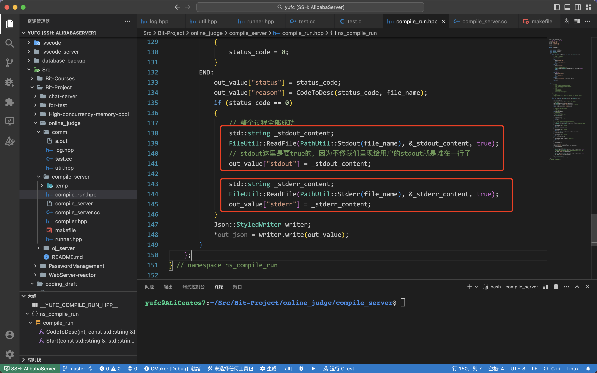

### 9.6 Testing the Code

First, compile directly with `make clean;make` to check for compilation issues.

Then we need to set up a testing method.

In `compile_server.cc`:

```cpp
#include "compile_run.hpp"
using namespace ns_compile_run;
int main()
{
    std::string in_json;
    Json::Value in_value;
    in_value["code"] = "";
    in_value["input"] = "";
    in_value["cpu_limit"] = 1;
    in_value["mem_limit"] = 10240 * 3;

    Json::FastWriter writer;
    in_json = writer.write(in_value);
    std::cout << in_json << std::endl; // Let's see what the result looks like first
    // compile_run::Start();
    return 0;
}
```

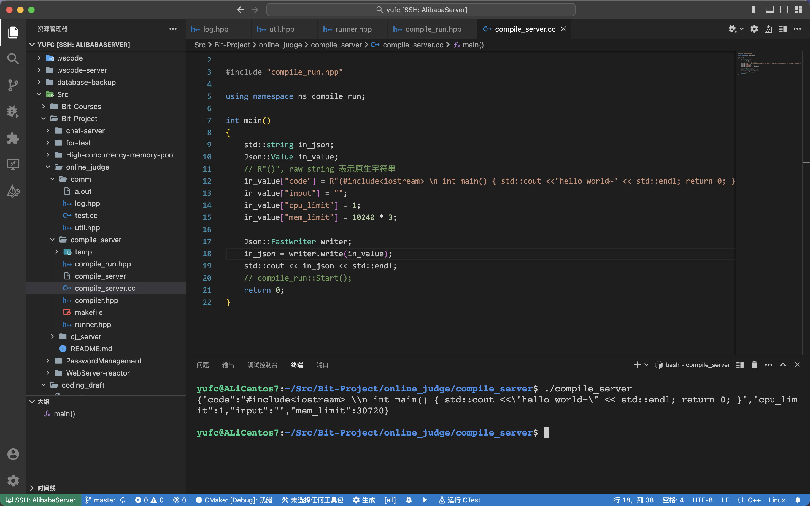

Let me introduce a C++11 tool: raw strings.

`R"()"` raw string

Because our code will definitely contain many special characters.

Writing it this way is correct; the above version still has some minor issues. Then we can run successfully.

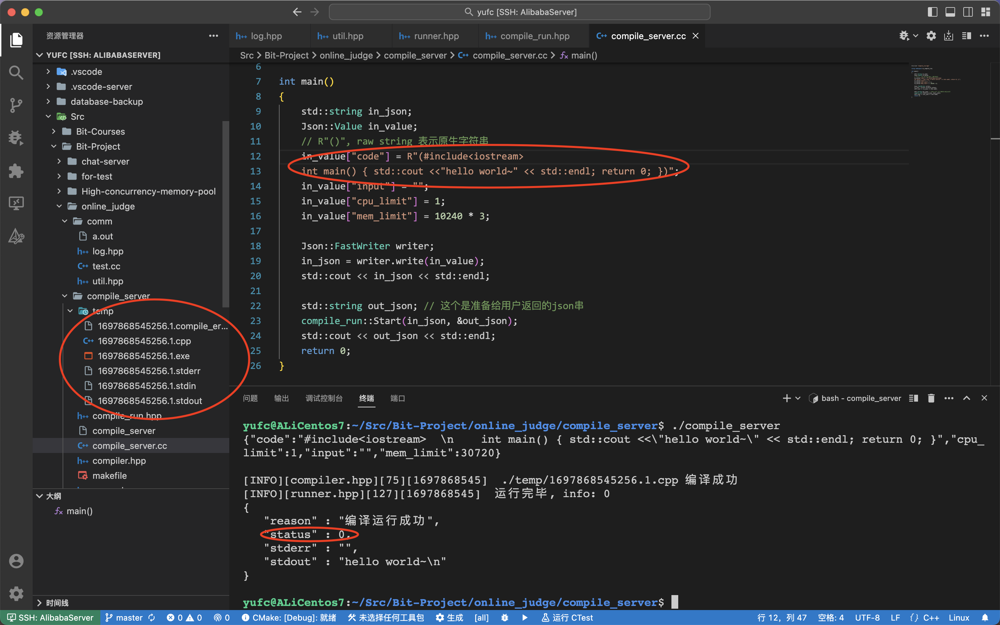

We can reproduce and test various errors by modifying the temporary code inside.

### 9.7 Cleanup Work

The temporary files we generate still need to be cleaned up.

```cpp
static void RemoveTempFile(const std::string &file_name)
{
    // The number of files to clean is uncertain, but we know which ones there are
    std::string src_file_name = PathUtil::Src(file_name);
    if (FileUtil::IsFileExists(src_file_name))
        unlink(src_file_name.c_str());
    std::string compiler_error_file_name = PathUtil::CompilerError(file_name);
    if (FileUtil::IsFileExists(compiler_error_file_name))
        unlink(compiler_error_file_name.c_str());

    std::string execute_file_name = PathUtil::Exe(file_name);
    if (FileUtil::IsFileExists(execute_file_name))
        unlink(execute_file_name.c_str());

    std::string stdin_file_name = PathUtil::Stdin(file_name);
    if (FileUtil::IsFileExists(stdin_file_name))
        unlink(stdin_file_name.c_str());

    std::string stdout_file_name = PathUtil::Stdout(file_name);
    if (FileUtil::IsFileExists(stdout_file_name))
        unlink(stdout_file_name.c_str());

    std::string stderr_file_name = PathUtil::Stderr(file_name);
    if (FileUtil::IsFileExists(stderr_file_name))
        unlink(stderr_file_name.c_str());
}
```

Actually, I feel like we could use program replacement with an rm script, which might also work.

### 9.8 Building the Network Service

#### 9.8.1 cpp-httplib Third-party Network Library

This library is very easy to use. It's header-only — you just need to copy the .h file over, very simple.

Note that using this library requires upgrading gcc/g++ to version 7, 8, 9, or higher, otherwise it won't work.

```bash
yufc@ALiCentos7:~/Src/Bit-Project/online_judge/comm$ gcc --version
gcc (GCC) 8.3.1 20190311 (Red Hat 8.3.1-3)
Copyright (C) 2018 Free Software Foundation, Inc.
This is free software; see the source for copying conditions.  There is NO
warranty; not even for MERCHANTABILITY or FITNESS FOR A PARTICULAR PURPOSE.
yufc@ALiCentos7:~/Src/Bit-Project/online_judge/comm$
```

Simple usage:

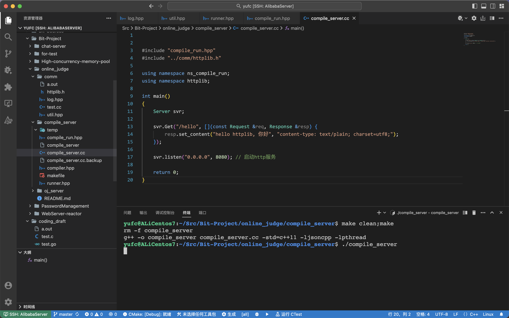


First, let's solve the Chinese character encoding issue.

This will work:

```cpp
svr.Get("/hello", [](const Request &req, Response &resp) {
    resp.set_content("hello httplib, 你好", "text/plain;charset=utf-8;");
});
```

#### 9.8.2 Building the Post Method

```cpp
svr.Post("/compile_and_run", [](const Request &req, Response &resp)
         {
    // The body of the user's request is the JSON string we want
    std::string in_json = req.body;
    std::string out_json;
    if (!in_json.empty())
    {
        compile_run::Start(in_json, &out_json);
        resp.set_content(out_json, "application/json;charset=utf-8");
    } });
```

This is easy to understand, nothing much to say. The user's incoming request is essentially the JSON string that the CR module needs.

#### 9.8.3 Comprehensive Testing with Postman

We can use Postman for testing. Just download it.

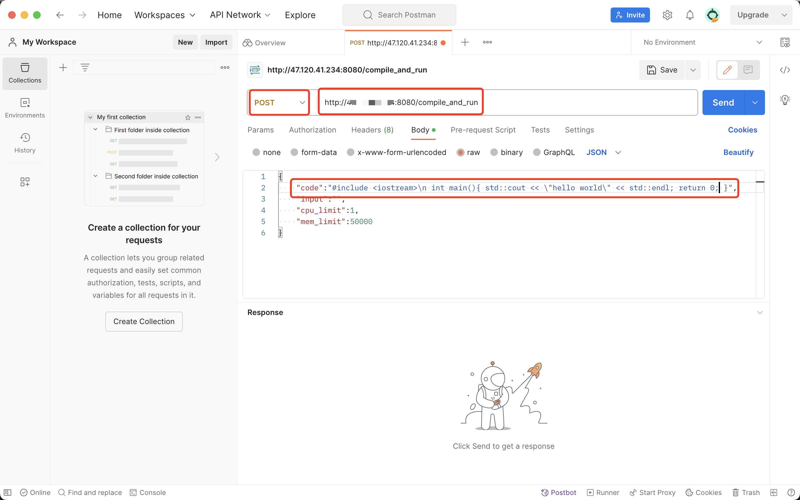

Done.

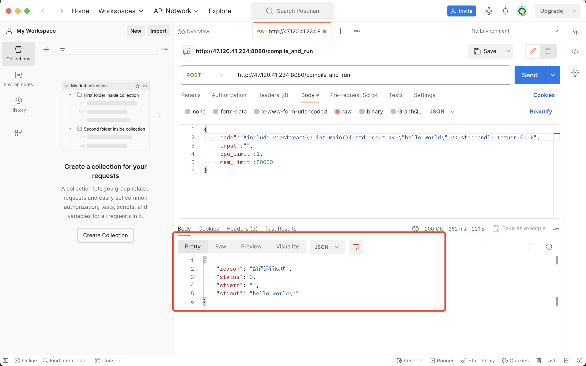

But there's still an issue. Since the compile_run module will eventually be accessed by oj_server, we don't want to hardcode the port number. So we want to use command-line arguments to invoke this CR module.

```cpp
#include "compile_run.hpp"
#include "../comm/httplib.h"
using namespace ns_compile_run;
using namespace httplib;
void Usage(std::string proc)
{
    std::cerr << "Usage: "
              << "\n\t" << proc << " port" << std::endl;
}

int main(int argc, char *argv[])
{
    if (argc != 2)
    {
        Usage(argv[0]);
        return 1;
    }
    Server svr;
#if false
    svr.Get("/hello", [](const Request &req, Response &resp)
            { resp.set_content("hello httplib, 你好", "text/plain;charset=utf-8;"); });
#endif
    svr.Post("/compile_and_run", [](const Request &req, Response &resp)
             {
        // The body of the user's request is the JSON string we want
        std::string in_json = req.body;
        std::string out_json;
        if (!in_json.empty())
        {
            compile_run::Start(in_json, &out_json);
            resp.set_content(out_json, "application/json;charset=utf-8");
        } });

    svr.listen("0.0.0.0", atoi(argv[1])); // Start the HTTP service

    return 0;
}
```

At this point, the compilation module is done!

## 10. oj_server Preparation

### 10.1 oj_server Preparation

**Essence: Writing a website**

1. Get the homepage — here we'll use the problem list as the homepage

2. Editor page

3. Submit and judge functionality

**MVC Architecture**

M: Model — usually the module that interacts with data, e.g., CRUD operations on the problem bank (file-based / MySQL-based)

V: View — usually takes data and constructs web pages, renders page content, and displays it to the user (browser)

C: Control — the controller, which is our core business logic

### 10.2 Prepare the File Directory

```bash
yufc@ALiCentos7:~/Src/Bit-Project/online_judge/oj_server$ ls
yufc@ALiCentos7:~/Src/Bit-Project/online_judge/oj_server$ touch oj_server.cc
yufc@ALiCentos7:~/Src/Bit-Project/online_judge/oj_server$ touch oj_view.hpp
yufc@ALiCentos7:~/Src/Bit-Project/online_judge/oj_server$ touch oj_model.hpp
yufc@ALiCentos7:~/Src/Bit-Project/online_judge/oj_server$ touch oj_control.hpp
yufc@ALiCentos7:~/Src/Bit-Project/online_judge/oj_server$ tree .
.
├── oj_control.hpp
├── oj_model.hpp
├── oj_server.cc
└── oj_view.hpp

0 directories, 4 files
yufc@ALiCentos7:~/Src/Bit-Project/online_judge/oj_server$
```

### 10.3 Write the Network Routing First

```cpp
#include <iostream>
#include "../comm/httplib.h"
using namespace httplib;

int main()
{
    // User request routing functionality
    Server svr;
    // Get the list of all problems
    svr.Get("/all_questions", [](const Request &req, Response &resp) {
        resp.set_content("This is the list of all problems", "text/plain; charset=utf-8");
    });
    // User wants to get the content of a specific problem by number
    // /question/100  ->  regex matching
    svr.Get(R"(/question/(\d+))", [](const Request &req, Response &resp){
        std::string number = req.matches[1]; // Here we get what the regex captured
        // Feel free to explore this further
        resp.set_content("This is a specific problem: " + number, "text/plain; charset=utf-8");
    });
    // User submission
    svr.Get(R"(/judge/(\d+))", [](const Request &req, Response &resp){
        std::string number = req.matches[1];
        resp.set_content("This is the judge for the specific problem: " + number, "text/plain; charset=utf-8");
    });

    svr.listen("0.0.0.0", 8080);
    return 0;
}
```

The specific responses can be filled in later.

### 10.4 Designing the Problem Bank (File-based)

> 1. Problem number
> 2. Problem title
> 3. Problem difficulty
> 4. Problem description
> 5. Time requirement (internal processing)
> 6. Memory requirement (internal processing)

Composed of two sets of files:

1. question.list: problem list (no problem content needed)
2. Problem description, preset code (header.cpp), test case code (tail.cpp)

These two are linked through the problem number.

```bash
yufc@ALiCentos7:~/Src/Bit-Project/online_judge/oj_server/questions$ tree .
.
├── 1
│   ├── desc.txt
│   ├── header.cpp
│   └── tail.cpp
└── question.list

1 directory, 4 files
yufc@ALiCentos7:~/Src/Bit-Project/online_judge/oj_server/questions$
```

**`question.list`**

```
1 判断回文数 简单 ? 1 30000
...
...
```

**`./1/desc.txt`**

```
Determine whether an integer is a palindrome. A palindrome is an integer that reads the same backward as forward.

Example 1:
Input: 121
Output: true

Example 2:
Input: -121
Output: false
Explanation: Reading from left to right, it is -121. Reading from right to left, it becomes 121-. Therefore it is not a palindrome.

Example 3:
Input: 10
Output: false
Explanation: Reading from right to left, it becomes 01. Therefore it is not a palindrome.

Advanced:
Can you solve this problem without converting the integer to a string?
```

**`./1/header.cpp`**

```cpp
#include <iostream>
#include <string>
#include <vector>
#include <map>
#include <algorithm>
using namespace std;


class Solution
{
public:
    bool isPalindrome(int x)
    {
        // write code here
        return true;
    }
};
```

This is what's shown to the user.

**`./1/tail.cpp`**

```cpp

#ifndef COMPILER_ONLINE
#include "header.cpp" // For IDE hints during development
#endif

void Test1()
{
    // Call the method by creating a temporary object
    bool ret = Solution().isPalindrome(121);
    if (ret)
    {
        std::cout << "Passed test case 1, testing 121 passed ... OK!" << std::endl;
    }
    else
    {
        std::cout << "Failed test case 1, tested value is: 121" << std::endl;
    }
}
void Test2()
{
    // Call the method by creating a temporary object
    bool ret = Solution().isPalindrome(-10);
    if (!ret)
    {
        std::cout << "Passed test case 2, testing -10 passed ... OK!" << std::endl;
    }
    else
    {
        std::cout << "Failed test case 2, tested value is: -10" << std::endl;
    }
}
int main()
{
    Test1();
    Test2();
    return 0;
}
```

The following code section is intended to be trimmed later, because it's only there to prevent red squiggly lines in the IDE during development:

```cpp
#ifndef COMPILER_ONLINE
#include "header.cpp" // For IDE hints during development
#endif
```

When compiling, just add the macro with `g++ -D COMPILER_ONLINE`.

## 11. Building the Model Code

### 11.1 Setting Up the Model Framework

First, build the framework.

```cpp
#ifndef __YUFC_OJ_MODEL_HPP__
#define __YUFC_OJ_MODEL_HPP__

#include <iostream>
#include <string>
#include <unordered_map>
#include <cassert>
#include <vector>
#include "../comm/log.hpp"

// Load all problem information from the question.list file into memory
// model: mainly used to interact with data and provide data access interfaces

namespace ns_model
{
    using namespace ns_log;
    struct Question
    {
    public:
        std::string __number; // Problem number (unique)
        std::string __title;  // Problem title
        std::string __star;   // Problem difficulty // Easy/Medium/Hard
        int __cpu_limit;      // Problem time limit
        int __mem_limit;      // Problem memory limit
        std::string __desc;   // Problem description
        std::string __header; // Preset code
        std::string __tail;   // Test cases, need to be concatenated with header to form complete code
    };

    const std::string question_list_root = "./questions/question.list";

    class Model
    {
    private:
        std::unordered_map<std::string, Question> __questions;

    public:
        Model()
        {
            assert(LoadQuestionList());
        }
        ~Model() {}

    public:
        bool LoadQuestionList(const std::string &question_list)
        {
            /*
                Load config file: questions/question.list + problem number files
            */
        }
        void GetAllQuestions(std::vector<Question> *out)
        {
        }
        void GetOneQuestions(const std::string &number, Question *q)
        {
        }

    };
};
#endif
```

### 11.2 Writing the Model Code

`GetAllQuestions` and `GetOneQuestions` are simple — just write them directly.

```cpp
bool GetAllQuestions(std::vector<Question> *out)
{
    if (__questions.size() == 0)
    {
        return false;
    }
    for (const auto &q : __questions)
    {
        out->push_back(q.second); // Move from hash map to vector
    }
    return true;
}
bool GetOneQuestions(const std::string &number, Question *q)
{
    const auto &iter = __questions.find(number);
    if (iter == __questions.end())
    {
        return false;
    }
    (*q) = iter->second;
    return true;
}
```

String splitting utility:

```cpp
class StringUtil
{
public:
    static void SplitString(const std::string &str, std::vector<std::string>* target, std::string sep)
    {
        /*
            str: the string to split
            target: output result
            sep: specified delimiter
        */

    }
};
```

Complete Model module code:

```cpp


#ifndef __YUFC_OJ_MODEL_HPP__
#define __YUFC_OJ_MODEL_HPP__

#include <iostream>
#include <string>
#include <unordered_map>
#include <cassert>
#include <vector>
#include <fstream>
#include <stdlib.h>
#include "../comm/log.hpp"
#include "../comm/util.hpp"

// Load all problem information from the question.list file into memory
// model: mainly used to interact with data and provide data access interfaces

namespace ns_model
{
    using namespace ns_log;
    using namespace ns_util;

    struct Question
    {
    public:
        std::string __number; // Problem number (unique)
        std::string __title;  // Problem title
        std::string __star;   // Problem difficulty // Easy/Medium/Hard
        int __cpu_limit;      // Problem time limit
        int __mem_limit;      // Problem memory limit
        std::string __desc;   // Problem description
        std::string __header; // Preset code
        std::string __tail;   // Test cases, need to be concatenated with header to form complete code
    };

    const std::string question_list_root = "./questions/question.list";
    const std::string question_path = "./questions/";
    class Model
    {
    private:
        std::unordered_map<std::string, Question> __questions;

    public:
        Model()
        {
            assert(LoadQuestionList(question_list_root));
        }
        ~Model() {}

    public:
        bool LoadQuestionList(const std::string &question_list)
        {
            /*
                Load config file: questions/question.list + problem number files
            */

            std::ifstream in(question_list);
            if (!in.is_open())
            {
                LOG(FATAL) << "Failed to load problem bank, please check if the problem bank file exists"
                           << "\n";
                return false;
            }
            // Read line by line
            std::string line;
            while (std::getline(in, line))
            {
                // Use space as delimiter
                // Split the string
                std::vector<std::string> tokens;
                StringUtil::SplitString(line, &tokens, " ");
                if (tokens.size() != 5) // Means splitting has issues
                {
                    LOG(WARNING) << "Failed to load some problems, please check the file format"
                                 << "\n";
                    continue;
                }
                Question q;
                q.__number = tokens[0];
                q.__title = tokens[1];
                q.__star = tokens[2];
                q.__cpu_limit = atoi(tokens[3].c_str());
                q.__mem_limit = atoi(tokens[4].c_str());

                std::string question_number_path = question_path;
                question_number_path += q.__number;
                question_number_path += "/";

                FileUtil::ReadFile(question_number_path + "desc.txt", &(q.__desc), true);
                FileUtil::ReadFile(question_number_path + "header.cpp", &(q.__header), true);
                FileUtil::ReadFile(question_number_path + "tail.cpp", &(q.__tail), true);

                __questions.insert({q.__number, q}); // Insert into hash map
            }
            LOG(INFO) << "Loading problem bank ... Success!"
                      << "\n";
            in.close();
        }
        bool GetAllQuestions(std::vector<Question> *out)
        {
            if (__questions.size() == 0)
            {
                LOG(ERROR) << "User failed to get problem bank"
                           << "\n";
                return false;
            }
            for (const auto &q : __questions)
            {
                out->push_back(q.second); // Move from hash map to vector
            }
            return true;
        }
        bool GetOneQuestions(const std::string &number, Question *q)
        {
            const auto &iter = __questions.find(number);
            if (iter == __questions.end())
            {
                LOG(ERROR) << "User failed to get problem, problem number: " << number << "\n";
                return false;
            }
            (*q) = iter->second;
            return true;
        }
    };
};

#endif
```

### 11.3 Installing the Boost Library

We have a string splitting method that hasn't been written yet. We plan to use the Boost library for it.

```bash
sudo yum install -y boost-devel
```

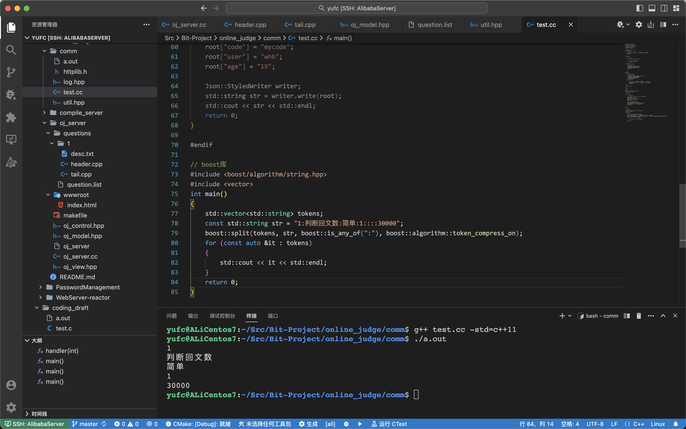

### 11.4 Using Boost Library to Complete the String Splitting Method

```cpp
static void SplitString(const std::string &str, std::vector<std::string> *target, const std::string &sep)
{
    /*
        str: the string to split
        target: output result
        sep: specified delimiter
    */
    // Boost library
    boost::split((*target), str, boost::is_any_of(sep), boost::algorithm::token_compress_on);
}
```

Done in one line.

## 12. Writing the Control Module's Basic Structure

First, write the basic structure.

```cpp
#ifndef __YUFC_OJ_CONTROL_HPP__
#define __YUFC_OJ_CONTROL_HPP__
#include <iostream>
#include <string>
#include "./oj_model.hpp"
#include "../comm/log.hpp"
#include "../comm/util.hpp"
namespace ns_control
{
    using namespace ns_log;
    using namespace ns_util;
    using namespace ns_model;

    class Control
    {
    private:
        Model __model;
    public:

    };
} // namespace ns_control
#endif
```

Then how does the cc file call it?

Like this:

```cpp
int main()
{
    // User request routing functionality
    Server svr;
    Control ctrl;

    // Get the list of all problems
    svr.Get("/all_questions", [&ctrl](const Request &req, Response &resp)
            {
        // Here I want to return an HTML page containing all the problem list information
        std::string html;
        ctrl.AllQuestions(&html);

        resp.set_content(html, "text/html; charset=utf-8"); });
  	// ...
  	return 0;
}
```

Then the Control structure becomes like this:

```cpp


#ifndef __YUFC_OJ_CONTROL_HPP__
#define __YUFC_OJ_CONTROL_HPP__

#include <iostream>
#include <string>
#include <vector>

#include "./oj_model.hpp"
#include "../comm/log.hpp"
#include "../comm/util.hpp"

namespace ns_control
{
    using namespace ns_log;
    using namespace ns_util;
    using namespace ns_model;

    class Control
    {
    private:
        Model __model;

    public:
        // Build web page based on problem data, html is an output parameter
        bool AllQuestions(std::string *html)
        {
            std::vector<Question> all;
            if (this->__model.GetAllQuestions(&all))
            {
                // Successfully got problem info, build all problems into a web page
            }
            else
            {
            }
        }
        bool Question(const std::string &number, std::string *html)
        {
            Question q;
            if (__model.GetOneQuestions(number, &q))
            {
                // Successfully got the specified problem
            }
            else
            {
            }
        }
    };
} // namespace ns_control

#endif
```

## 13. Introduction to ctemplate Frontend Rendering Library

### 13.1 Installing ctemplate

```url
https://github.com/OlafvdSpek/ctemplate
```


I installed it in this location on my machine:

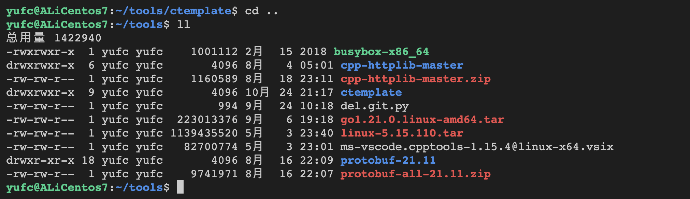

Enter this directory.

Run this command:

```bash
./autogen.sh
```

Then run this command:

```bash
./configure
```

Then run this command:

```bash
make
```

Then run this command:

```bash
sudo make install
```

### 13.2 Basic Usage

Two things are needed:

1. A data dictionary to store data
2. The web page content to be rendered

**`test.cc`**

```cpp

#include <iostream>
#include <sys/time.h>
#include <sys/resource.h>
#include <unistd.h>
#include <signal.h>

#include <ctemplate/template.h>

int main()
{
    std::string in_html = "./test.html";
    std::string value = "bitejiuyeke";

    // Create data dictionary
    ctemplate::TemplateDictionary root("test"); // Similar to unordered_map
    root.SetValue("key", value);                // test.insert({})

    // Get the web page object to be rendered
    ctemplate::Template *tpl = ctemplate::Template::GetTemplate(in_html, ctemplate::DO_NOT_STRIP);

    // Add dictionary data to the web page
    std::string out_html;
    tpl->Expand(&out_html, &root);
    std::cout << out_html << std::endl;
    return 0;
}
```

**`test.html`**

```html
<!DOCTYPE html>
<html lang="en">
<head>
    <meta charset="UTF-8">
    <meta name="viewport" content="width=device-width, initial-scale=1.0">
    <title>For Testing</title>
</head>
<body>
    <p>{{key}}</p>
    <p>{{key}}</p>
    <p>{{key}}</p>
    <p>{{key}}</p>
</body>
</html>
```

All instances of key will be replaced.

You might encounter an issue when running the executable:

```bash
./test: error while loading shared libraries: libctemplate.so.3: cannot open shared object file: No such file or directory
```

Just add the environment variable:

```bash
export LD\_LIBRARY\_PATH=$LD\_LIBRARY\_PATH:/usr/local/lib
```

You can also add it to `~/.bash_profile`.

### 13.3 Writing the View Module

First, let's supplement the Control module calls.

```cpp
class Control
{
private:
    Model __model;
    View __view;
public:
    // Build web page based on problem data, html is an output parameter
    bool AllQuestions(std::string *html)
    {
        bool ret = true;
        std::vector<struct Question> all;
        if (this->__model.GetAllQuestions(&all))
        {
            // Successfully got problem info, build all problems into a web page
            __view.AllExpandHtml(all, html);
        }
        else
        {
            *html = "Failed to get page, failed to get problem list";
            ret = false;
        }
        return ret;
    }
    bool Question(const std::string &number, std::string *html)
    {
        bool ret = true;
        struct Question q;
        if (__model.GetOneQuestions(number, &q))
        {
            // Successfully got the specified problem
            __view.OneExpandHtml(q, html);
        }
        else
        {
            *html = "Specified problem, number: " + number + " does not exist";
            ret = false;
        }
        return ret;
    }
};
```

**Now we need to write the View module's `AllExpandHtml` and `OneExpandHtml` methods.**

```cpp

#ifndef __YUFC_OJ_VIEW_HPP__
#define __YUFC_OJ_VIEW_HPP__

#include <iostream>
#include <string>
#include <ctemplate/template.h>

#include "./oj_model.hpp"

namespace ns_view
{
    using namespace ns_model;

    /*
        struct Question
        {
        public:
            std::string __number; // Problem number (unique)
            std::string __title;  // Problem title
            std::string __star;   // Problem difficulty // Easy/Medium/Hard
            int __cpu_limit;      // Problem time limit
            int __mem_limit;      // Problem memory limit
            std::string __desc;   // Problem description
            std::string __header; // Preset code
            std::string __tail;   // Test cases, need to be concatenated with header to form complete code
        };
    */

    class View
    {
    public:
        View() {}
        ~View() {}

    public:
        void AllExpandHtml(const std::vector<struct Question> questions, std::string *html)
        {
        }
        void OneExpandHtml(const struct Question &q, std::string *html)
        {
        }
    };
}

#endif
```

### 13.4 Preparing Some Frontend Files

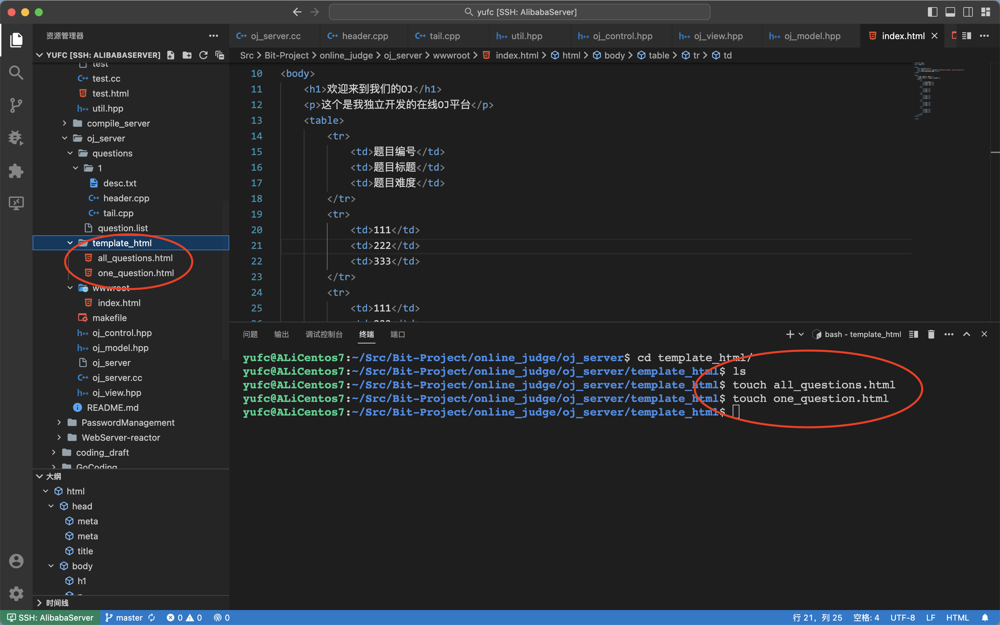

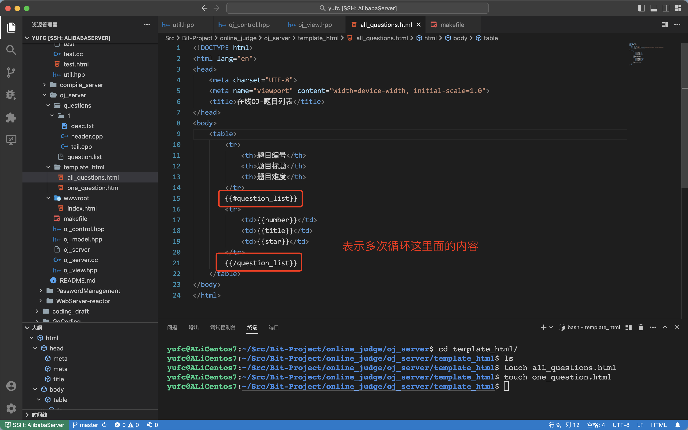

### 13.5 Getting the Problem List

```cpp
void AllExpandHtml(const std::vector<struct Question> questions, std::string *html)
{
    // 1. Form the path
    std::string src_html = template_path + "all_questions.html";
    // 2. Create data dictionary
    ctemplate::TemplateDictionary root("all_questions");
    for (const auto &q : questions)
    {
        ctemplate::TemplateDictionary *sub = root.AddSectionDictionary("question_list");
        sub->SetValue("number", q.__number);
        sub->SetValue("title", q.__title);
        sub->SetValue("star", q.__star);
    }
    // 3. Get the HTML to be rendered
    ctemplate::Template *tpl = ctemplate::Template::GetTemplate(src_html, ctemplate::DO_NOT_STRIP);

    // 4. Execute rendering
    tpl->Expand(html, &root);
}
```


### 13.6 Getting a Single Problem

```cpp
void OneExpandHtml(const struct Question &q, std::string *html)
{
    std::string src_html = template_path + "one_question.html";
    ctemplate::TemplateDictionary root("one_question");
    root.SetValue("number", q.__number);
    root.SetValue("title", q.__title);
    root.SetValue("star", q.__star);
    root.SetValue("desc", q.__desc);
    root.SetValue("pre_code", q.__header);
    ctemplate::Template *tpl = ctemplate::Template::GetTemplate(src_html, ctemplate::DO_NOT_STRIP);
    tpl->Expand(html, &root);
}
```

```html
<!DOCTYPE html>
<html lang="en">
<head>
    <meta charset="UTF-8">
    <meta name="viewport" content="width=device-width, initial-scale=1.0">
    <title>{{number}}.{{title}}</title>
</head>
<body>
    <h4>{{number}}.{{title}}.{{star}}</h4>
    <p>{{desc}}</p>
    <textarea name="code" id="" cols="30" rows="10">{{pre_code}}</textarea>
</body>
</html>
```

## 14. Writing the Load Balancing Module

### 14.1 Preparation

```cpp
void Judge(const std::string in_json, std::string *out_json)
{
    /*
        in_json contains:
        # 1. id
        # 2. code: #include ...
        # 3. input: ""
    */
    // 1. Deserialize in_json
    // 2. Re-concatenate user code + test case code to form new code
    // 3. Select the host with the lowest load, then make an HTTP request and get the result
    // 4. Assign the result to out_json
}
```

This is what we need to do.

We plan to put our host information in this configuration file.

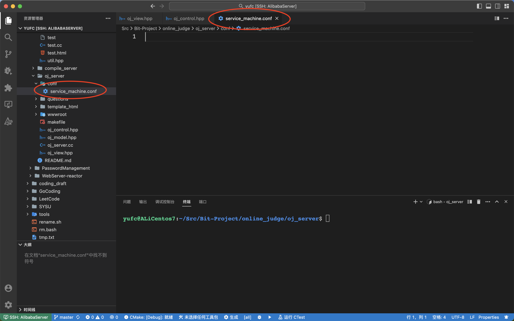

### 14.2 Writing the Load Balancing Module Structure

```cpp
/* class Machine represents a service-providing host */
class Machine
{

};
/* Load balancing module */
class LoadBalance
{

};
```

```cpp
/* class Machine represents a service-providing host */
class Machine
{
public:
    std::string __ip;  // Compilation service IP
    int __port;        // Compilation service port
    uint64_t __load;   // Current compilation service load
    std::mutex *__mtx; // C++ mutex prohibits copying, so define as pointer
public:
    Machine() : __ip(""), __port(0), __load(0), __mtx(nullptr) {}
    ~Machine() {}
};
/* Load balancing module */
const std::string service_machine_path = "./conf/service_machine.conf";
class LoadBalance
{
private:
    // Each host has its own index, we use the index as the host's ID
    std::vector<Machine> __machines; // All hosts
    std::vector<int> __online;       // Online host IDs
    std::vector<int> __offline;      // Offline host IDs
public:
    LoadBalance()
    {
        assert(this->LoadConf(service_machine_path));
    }
    ~LoadBalance() {}

public:
    bool LoadConf(const std::string &machine_list)
    {
    }
    // Intelligent selection
    bool int_select()
    {
    }
    void OfflineMachine()
    {
    }
    void OnlineMachine()
    {
    }
};
```

### 14.3 Completing the Load Balancing Module Code

#### 14.3.1 Loading the Configuration File

```cpp
bool LoadConf(const std::string &machine_conf)
{
    std::ifstream in(machine_conf);
    if (!in.is_open())
    {
        LOG(FATAL) << "Loading: " << machine_conf << " failed"
                   << "\n";
        return false;
    }
    std::string line;
    while (std::getline(in, line))
    {
        std::vector<std::string> tokens;
        StringUtil::SplitString(line, &tokens, ":");
        if (tokens.size() != 2)
        {
            LOG(WARNING) << "Splitting " << line << " failed"
                         << "\n";
            continue;
        }
        Machine m;
        m.__ip = tokens[0];
        m.__port = atoi(tokens[1].c_str());
        m.__load = 0;
        m.__mtx = new std::mutex();
        __online.push_back(__machines.size()); // All hosts are started
        __machines.push_back(m); // Add to the host list
    }
    in.close();
    return true;
}
```

#### 14.3.2 Intelligent Host Selection

To ensure safety when selecting hosts, we also need to add a mutex to the `LoadBalance` class.

```cpp
bool IntelligentSelect(int *id, Machine **m)
{
    // 1. Use the selected host (update the host's load)
    // 2. We may take this host offline
    /*
        id: output parameter
        m: the selected host
    */
    __mtx.lock();
    // Load balancing algorithm
    // 1. Random number method
    // 2. Round-robin + hash
    int online_num = __online.size();
    if (online_num == 0)
    {
        __mtx.unlock();
        LOG(FATAL) << "All backend compilation hosts are offline, operations team please check immediately"
                   << "\n";
        return false;
    }
    // Initialize return values
    *id = __online[0];
    *m = &__machines[__online[0]];
    uint64_t min_load = __machines[__online[0]].GetLoad();
    for (int i = 0; i < online_num; i++)
    {
        // Find the machine with the lowest load by traversal
        uint64_t temp_load = __machines[__online[i]].GetLoad();
        if (min_load > temp_load)
        {
            min_load = temp_load; // Update load information
            *id = __online[i];
            *m = &__machines[__online[i]];
        }
    }
    __mtx.unlock();
    return true;
}
```

Writing to this point, we realize that hosts need their own way to update their load.

```cpp
/* class Machine represents a service-providing host */
class Machine
{
public:
    std::string __ip;  // Compilation service IP
    int __port;        // Compilation service port
    uint64_t __load;   // Current compilation service load
    std::mutex *__mtx; // C++ mutex prohibits copying, so define as pointer
public:
    Machine() : __ip(""), __port(0), __load(0), __mtx(nullptr) {}
    ~Machine() {}

public:
    // Increase load
    void IncLoad()
    {
        if (__mtx)
            __mtx->lock();
        __load++;
        if (__mtx)
            __mtx->unlock();
    }
    // Decrease load
    void DecLoad()
    {
        if (__mtx)
            __mtx->lock();
        __load--;
        if (__mtx)
            __mtx->unlock();
    }
    // Get host load
    uint64_t GetLoad()
    {
        uint64_t cur_load = 0;
        if (__mtx)
            __mtx->lock();
        cur_load = this->__load;
        if (__mtx)
            __mtx->unlock();
        return cur_load;
    }
};
```

### 14.4 Judge Implementation - Part 1

```cpp
void Judge(const std::string &number, const std::string in_json, std::string *out_json)
{
    /*
        in_json contains:
        # 1. code: #include ...
        # 2. input: ""
    */
    // 0. Get the corresponding problem details based on the problem number
    struct Question q;
    __model.GetOneQuestions(number, &q);
    // 1. Deserialize in_json
    Json::Value in_value;
    Json::Reader reader;
    reader.parse(in_json, in_value);
    std::string code = in_value["code"].asString();
    // 2. Re-concatenate user code + test case code to form new code
    Json::Value compile_value; // This will be sent to the CR service
    compile_value["input"] = in_value["input"].asString();
    compile_value["code"] = code + q.__tail; // Concatenate the code!
    compile_value["cpu_limit"] = q.__cpu_limit;
    compile_value["mem_limit"] = q.__mem_limit;
    Json::FastWriter writer;
    std::string compile_str = writer.write(compile_value); // compile_str is ready to send to CR
    // 3. Select the host with the lowest load, then make an HTTP request and get the result
    // Rule: keep selecting until a host is available, otherwise all are down
    while (true)
    {
        int id = 0;
        Machine *m = nullptr;
        if (!__load_balance.IntelligentSelect(&id, &m))
        {
            break; // IntelligentSelect already has logging
        }
        LOG(INFO) << "Host selected successfully, host id: " << id << " details: "
                  << m->__ip << ":" << m->__port << "\n";
        // Make the request
        httplib::Client cli(m->__ip, m->__port);
        m->IncLoad(); // Increase this host's load
        if (auto res = cli.Post("/compile_and_run", compile_str, "application/json;charset=utf-8"))
        {
            // res is actually a Result type
            *out_json = res->body;
            m->DecLoad(); // Request completed, decrease load
            break;
        }
        else
        {
            // Request failed
            LOG(INFO) << "Current request host id: " << id << " details: "
                      << m->__ip << ":" << m->__port << " may be offline" << "\n";
            m->DecLoad(); // Not necessary
            __load_balance.OfflineMachine(id); // Take this machine offline
        }
    }
}
```

The overall logic isn't particularly difficult — it's all fairly easy to understand. Pay attention to the httplib client usage.

Of course there are still issues. We know that only when the status code is 200 does the request count as successful — getting a response doesn't mean success.

So it's better to add a check:

```cpp
// Make the request
httplib::Client cli(m->__ip, m->__port);
m->IncLoad(); // Increase this host's load
if (auto res = cli.Post("/compile_and_run", compile_str, "application/json;charset=utf-8"))
{
    // res is actually a Result type
    if (res->status == 200)
    {
        *out_json = res->body;
        m->DecLoad(); // Request completed, decrease load
        break;
    }
    m->DecLoad();
}
else
{
    // Request failed
    LOG(INFO) << "Current request host id: " << id << " details: "
              << m->__ip << ":" << m->__port << " may be offline"
              << "\n";                         // Not necessary
    __load_balance.OfflineMachine(id); // Take this machine offline (this will also reset the load to 0)
}
```

### 14.5 OfflineMachine

```cpp
void OfflineMachine(int which)
{
    __mtx.lock();
    for (auto iter = __online.begin(); iter != __online.end(); iter++)
    {
        if(*iter == which)
        {
            // Found the host to take offline
            __online.erase(iter);
            __offline.push_back(*iter);
            break; // Because of break, we temporarily don't need to worry about iterator invalidation
        }
    }
    __mtx.unlock();
}
```

### 14.6 OnlineMachine

When all hosts are offline, we bring them all back online together.

We'll write this later, because right now we don't even know what the running state looks like.

### 14.7 Postman Testing

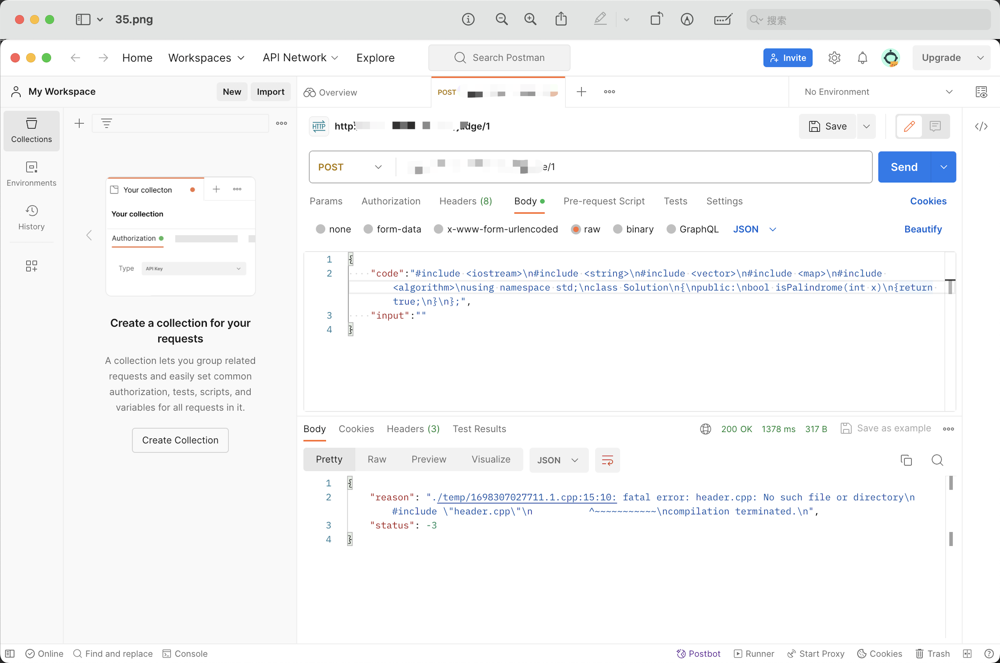

This issue appears because of a leftover problem we haven't solved yet.

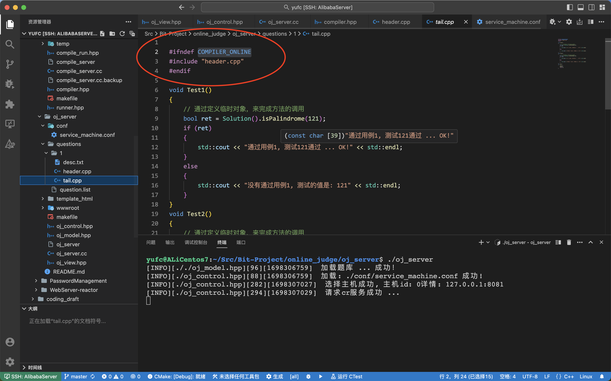

This needs to be removed! So when we call g++, we need to include the macro!

```cpp
execlp("g++", "g++", "-o", PathUtil::Exe(file_name).c_str(), PathUtil::Src(file_name).c_str(), "-std=c++11", "-D", "COMPILER_ONLINE", nullptr);
```

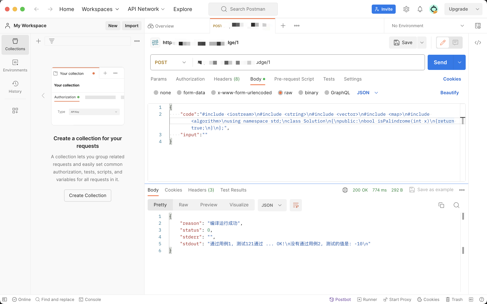

After the fix, everything works fine.

## 15. Frontend Development

### 15.1 Prerequisite Knowledge

Now we need to write the frontend. We first need to be able to write a passable frontend to submit code for testing, otherwise we can't debug.

- A basic version of the homepage
- List of all problems
- The coding page for a specified problem + code submission

Does a backend developer need to care about frontend pages? Not at all. So why are we writing it? If you don't want to write it, just copy and paste.

1. Any project needs both frontend and backend
2. Although the backend doesn't care about pages, it needs to understand how frontend and backend interact
3. For written exams and interviews, backend doesn't need frontend knowledge, but it's good to have some understanding of the frontend

When writing pages, you need the three pillars: HTML + CSS + JS

### 15.2 Getting Started

Adjusting styles essentially means adjusting the styles of HTML tags:

1. Select the tag
2. Set the style

### 15.3 Homepage

```html
<!DOCTYPE html>
<html lang="en">

<head>
    <meta charset="UTF-8">
    <meta name="viewport" content="width=device-width, initial-scale=1.0">
    <title>My Personal OJ System</title>
    <!-- Page styles -->
    <style>
        * {
            /* Remove default margin */
            margin: 0px;
            /* Remove default padding */
            padding: 0px;
        }

        html,
        body {
            width: 100%;
            height: 100%;
        }

        .container .navbar {
            width: 100%;
            height: 50px;
            background-color: black;
            /* Set overflow on parent to cancel float effects */
            overflow: hidden;
        }

        .container .navbar a {
            display: inline-block;
            /* Set a tag width */
            width: 80px;
            /* Set font */
            color: white;
            font-size: larger;
            /* Vertical centering */
            line-height: 50px;
            /* Same height as navbar */
            text-decoration: none;
            /* Center text */
            text-align: center;
        }

        /* Set mouse hover event */
        .container .navbar a:hover {
            background-color: green;
        }

        .container .navbar .login {
            float: right;
        }

        .container .content {
            width: 800px;
            /* background-color: #ccc; */
            /* Center overall */
            margin: 0px auto;
            /* Center text */
            text-align: center;
            /* Set top margin */
            margin-top: 200px;
        }

        .container .content .font_ {
            /* Set tag as block element, takes full width, can set height/width properties */
            display: block;
            /* Set top margin */
            margin-top: 20px;
            /* Remove underline */
            text-decoration: none;
        }

        /* Adjust the font size for the header */
        .container .content .font_:first-child {
            font-size: 40px; /* You can adjust the size as needed */
        }
        .container .content .font_:nth-child(2) {
            font-size: 28px; /* You can adjust the size as needed */
        }
    </style>
</head>

<body>
    <div class="container">
        <!-- Navigation bar, functionality not implemented -->
        <div class="navbar">
            <a href="#">Home</a>
            <a href="/all_questions">Problems</a>
            <a href="#">Contest</a>
            <a href="#">Discussion</a>
            <a href="#">Jobs</a>
            <a class="login" href="#">Login</a>
        </div>
        <!-- Page content -->
        <div class="content">
            <h1 class="font_">~~Welcome to OnlineJudge System~~</h1>
            <p class="font_">This is my independently developed online OJ platform</p>
            <h2 class="font_">
                <a href="/all_questions">Click here to start coding~</a>
            </h2>
        </div>
    </div>
</body>

</html>
```

### 15.4 Problem List

```html
<!DOCTYPE html>
<html lang="en">

<head>
    <meta charset="UTF-8">
    <meta name="viewport" content="width=device-width, initial-scale=1.0">
    <title>Online OJ - Problem List</title>
    <style>
        * {
            /* Remove default margin */
            margin: 0px;
            /* Remove default padding */
            padding: 0px;
        }

        html,
        body {
            width: 100%;
            height: 100%;
        }

        .container .navbar {
            width: 100%;
            height: 50px;
            background-color: black;
            /* Set overflow on parent to cancel float effects */
            overflow: hidden;
        }

        .container .navbar a {
            display: inline-block;
            /* Set a tag width */
            width: 80px;
            /* Set font */
            color: white;
            font-size: larger;
            /* Vertical centering */
            line-height: 50px;
            /* Same height as navbar */
            text-decoration: none;
            /* Center text */
            text-align: center;
        }

        /* Set mouse hover event */
        .container .navbar a:hover {
            background-color: green;
        }

        .container .navbar .login {
            float: right;
        }

        .container .question_list {
            padding: 50px;
            width: 800px;
            height: 630px;
            margin: 0px auto;
            /* background-color: #ccc; */
            text-align: center;
        }
        .container .question_list table {
            margin-top: 30px;
            width: 100%;
            font-size: large;
            font-family: 'Times New Roman', Times, serif;
            background-color: #f8f8f8;
        }
        .container .question_list h1 {
            font-size: 30px;
            color: black;
        }
        .container .question_list table .item {
            width: 100px;
            height: 30px;
            padding-top: 7px;
            padding-bottom: 7px;
            font-size: large;
            font-family: 'Times New Roman', Times, serif;
        }
        .container .question_list table .item a:hover {
            color: blue;
            font-weight: bold;
        }
        .container .footer {
            width: 100%;
            height: 100%;
            text-align: center;
            color: #ccc;
            line-height: 50px;
        }
    </style>
</head>

<body>
    <div class="container">
        <div class="navbar">
            <a href="/">Home</a>
            <a href="/all_questions">Problems</a>
            <a href="#">Contest</a>
            <a href="#">Discussion</a>
            <a href="#">Jobs</a>
            <a class="login" href="#">Login</a>
        </div>
        <div class="question_list">
            <h1>OnlineJudge Problem List</h1>
            <table>
                <tr>
                    <th class="item">Problem Number</th>
                    <th class="item">Problem Title</th>
                    <th class="item">Difficulty</th>
                </tr>
                {{#question_list}}
                <tr>
                    <td class="item">{{number}}</td>
                    <td class="item"><a href="/question/{{number}}">{{title}}</a></td>
                    <td class="item">{{star}}</td>
                </tr>
                {{/question_list}}
            </table>
        </div>
        <div class="footer">
            <!-- <hr> -->
            <h4>@Author: Yufc</h4>
        </div>
    </div>

</body>

</html>
```

### 15.5 Building a Single Problem Page with Ace Online Editor (Just Copy and Paste)

```html
<!DOCTYPE html>
<html lang="en">

<head>
    <meta charset="UTF-8">
    <meta http-equiv="X-UA-Compatible" content="IE=edge">
    <meta name="viewport" content="width=device-width, initial-scale=1.0">
    <title>{{number}}.{{title}}</title>
    <!-- Import ACE plugin -->
    <!-- Official website: https://ace.c9.io/ -->
    <!-- CDN link: https://cdnjs.com/libraries/ace -->
    <!-- Usage guide: https://www.iteye.com/blog/ybc77107-2296261 -->
    <!-- https://justcode.ikeepstudying.com/2016/05/ace-editor-
%E5%9C%A8%E7%BA%BF%E4%BB%A3%E7%A0%81%E7%BC%96%E8%BE%91%E6%9E%81%E5%85%B6%E9%AB%98%E4%BA%AE/
-->
    <!-- Import ACE CDN -->
    <script src="https://cdnjs.cloudflare.com/ajax/libs/ace/1.2.6/ace.js" type="text/javascript"
        charset="utf-8"></script>
    <script src="https://cdnjs.cloudflare.com/ajax/libs/ace/1.2.6/ext-language_tools.js" type="text/javascript"
        charset="utf-8"></script>
    <!-- Import jQuery CDN -->
    <script src="http://code.jquery.com/jquery-2.1.1.min.js"></script>
    <style>
        * {
            margin: 0;
            padding: 0;
        }

        html,
        body {
            width: 100%;
            height: 100%;
        }

        .container .navbar {
            width: 100%;
            height: 50px;
            background-color: black;
            /* Set overflow on parent to cancel float effects */
            overflow: hidden;
        }

        .container .navbar a {
            /* Set a tag as inline-block element, allows setting width */
            display: inline-block;
            /* Set a tag width, a tag is inline by default, can't set width */
            width: 80px;
            /* Set font color */
            color: white;
            /* Set font size */
            font-size: large;
            /* Set text height same as navbar height */
            line-height: 50px;
            /* Remove a tag underline */
            text-decoration: none;
            /* Center text in a tag */
            text-align: center;
        }

        /* Set mouse hover event */
        .container .navbar a:hover {
            background-color: green;
        }

        .container .navbar .login {
            float: right;
        }

        .container .part1 {
            width: 100%;
            height: 600px;
            overflow: hidden;
        }

        .container .part1 .left_desc {
            width: 50%;
            height: 600px;
            float: left;
            overflow: scroll;
        }

        .container .part1 .left_desc h3 {
            padding-top: 10px;
            padding-left: 10px;
        }

        .container .part1 .left_desc pre {
            padding-top: 10px;
            padding-left: 10px;
            font-size: medium;
            font-family: 'Gill Sans', 'Gill Sans MT', Calibri, 'Trebuchet MS', sans-serif;
        }

        .container .part1 .right_code {
            width: 50%;
            float: right;
        }

        .container .part1 .right_code .ace_editor {
            height: 600px;
        }

        .container .part2 {
            width: 100%;
            /* height: 185px;
            height: 100%; */
            overflow: hidden;
            /* background-color: #e2e2e2; */
        }

        .container .part2 .result {
            width: 300px;
            float: left;
        }

        .container .part2 .btn-submit {
            width: 120px;
            height: 50px;
            font-size: large;
            float: right;
            background-color: #0aa610;
            color: #FFF;
            /* Add rounded corners to button */
            border-radius: 1ch;
            border: 0px;
            margin-top: 10px;
            margin-right: 10px;
        }

        .container .part2 button:hover {
            background-color: rgb(1, 91, 1);
        }

        .container .part2 .result {
            margin-top: 15px;
            margin-left: 15px;
        }

        .container .part2 .result pre {
            font-size: large;
        }
    </style>
</head>

<body>
    <div class="container">
        <!-- Navigation bar, functionality not implemented -->
        <div class="navbar">
            <a href="/">Home</a>
            <a href="/all_questions">Problems</a> <a href="#">Contest</a>
            <a href="#">Discussion</a>
            <a href="#">Jobs</a>
            <a class="login" href="#">Login</a>
        </div>
        <!-- Left-right layout, problem description and preset code -->
        <div class="part1">
            <div class="left_desc">
                <h3><span id="number">{{number}}</span>.{{title}}_{{star}}</h3>
                <pre>{{desc}}</pre>
            </div>
            <div class="right_code">
                <pre id="code" class="ace_editor"><textarea class="ace_text-input">{{pre_code}}</textarea></pre>
            </div>
        </div>
        <!-- Submit and get result, then display -->
        <div class="part2">
            <div class="result"></div>
            <button class="btn-submit" onclick="submit()">Submit Code</button>
        </div>
    </div>
    <script>
        // Initialize object
        editor = ace.edit("code");
        // Set theme and language (more themes and languages available on GitHub)
        // Theme gallery: http://www.manongjc.com/detail/25-cfpdrwkkivkikmk.html
        editor.setTheme("ace/theme/textmate");
        editor.session.setMode("ace/mode/c_cpp");
        // Font size
        editor.setFontSize(16);
        // Set default tab size:
        editor.getSession().setTabSize(4);
        // Set read-only (true for read-only, used for code display)
        editor.setReadOnly(false);
        // Enable autocomplete menu
        ace.require("ace/ext/language_tools");
        editor.setOptions({
            enableBasicAutocompletion: true,
            enableSnippets: true,
            enableLiveAutocompletion: true
        });
        function submit() {
            // alert("Hey!");
            // 1. Collect relevant data from the current page: 1. problem number 2. code
            var code = editor.getSession().getValue();
            // console.log(code);
            var number = $(".container .part1 .left_desc h3 #number").text();
            // console.log(number);
            var judge_url = "/judge/" + number;
            // console.log(judge_url);
            // 2. Build JSON and send an HTTP-based JSON request to the backend via ajax
            $.ajax({
                method: 'Post', // Request method to backend
                url: judge_url, // Send request to the specified URL
                dataType: 'json', // Tell the server what format I need
                contentType: 'application/json;charset=utf-8', // Tell the server what I'm giving
                data: JSON.stringify({
                    'code': code,
                    'input': ''
                }),
                success: function (data) { // Successfully got result
                    // console.log(data);
                    show_result(data);
                }
            });
            // 3. Get result, parse it and display in the result div
            function show_result(data) {
                // console.log(data.status);
                // console.log(data.reason);
                // Get the result label tag
                var result_div = $(".container .part2 .result"); // Clear previous result
                result_div.empty();
                // First get the result status code and reason
                var _status = data.status;
                var _reason = data.reason;
                var reason_lable = $("<p>", {
                    text: _reason
                });
                reason_lable.appendTo(result_div);
                if (status == 0) {
                    // Request was successful, no issues in compilation/execution, but whether it passed depends on test results
                    var _stdout = data.stdout;
                    var _stderr = data.stderr;
                    var stdout_lable = $("<pre>", {
                        text: _stdout
                    });
                    var stderr_lable = $("<pre>", {
                        text: _stderr
                    })
                    stdout_lable.appendTo(result_div);
                    stderr_lable.appendTo(result_div);
                }
                else {
                    // Compilation/execution error, do nothing
                }
            }
        }
    </script>
</body>

</html>
```

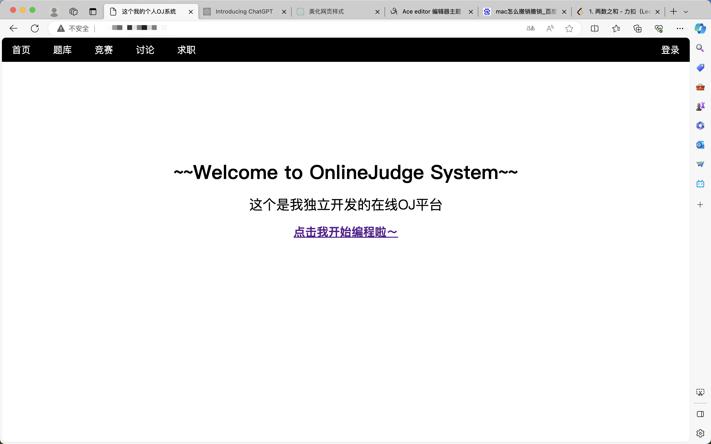


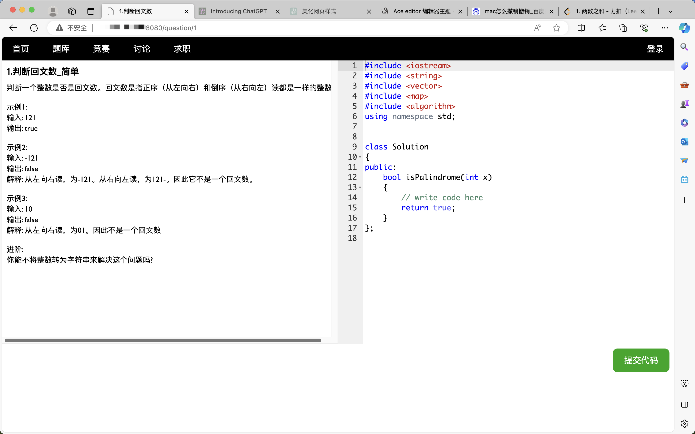

## 16. Integration Testing

### 16.1 Solving the Problem List Ordering Issue

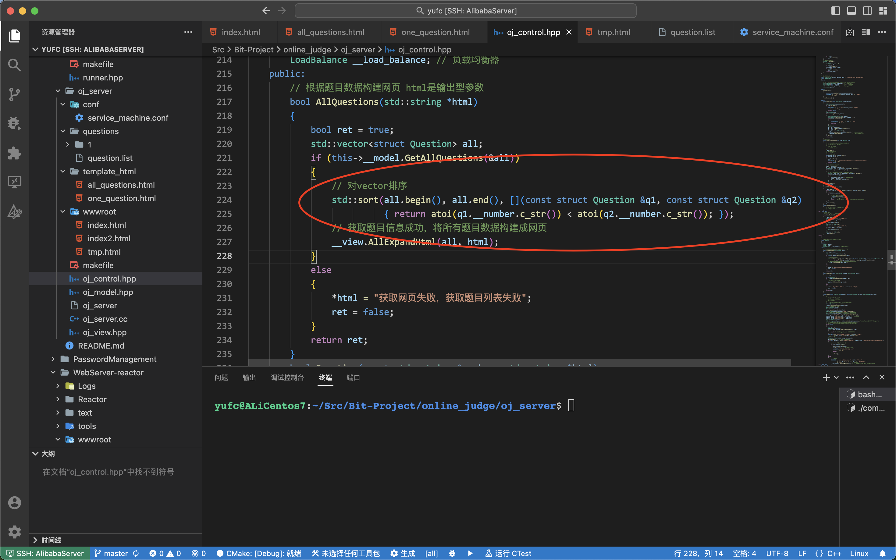

### 16.2 Solving the Issue When All Hosts Go Offline and Then Come Back Online

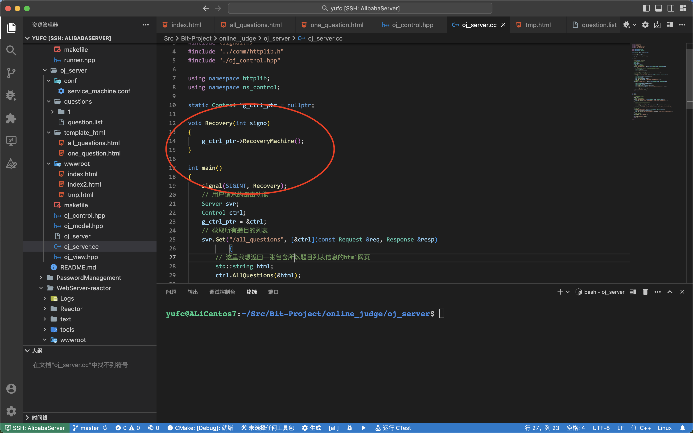

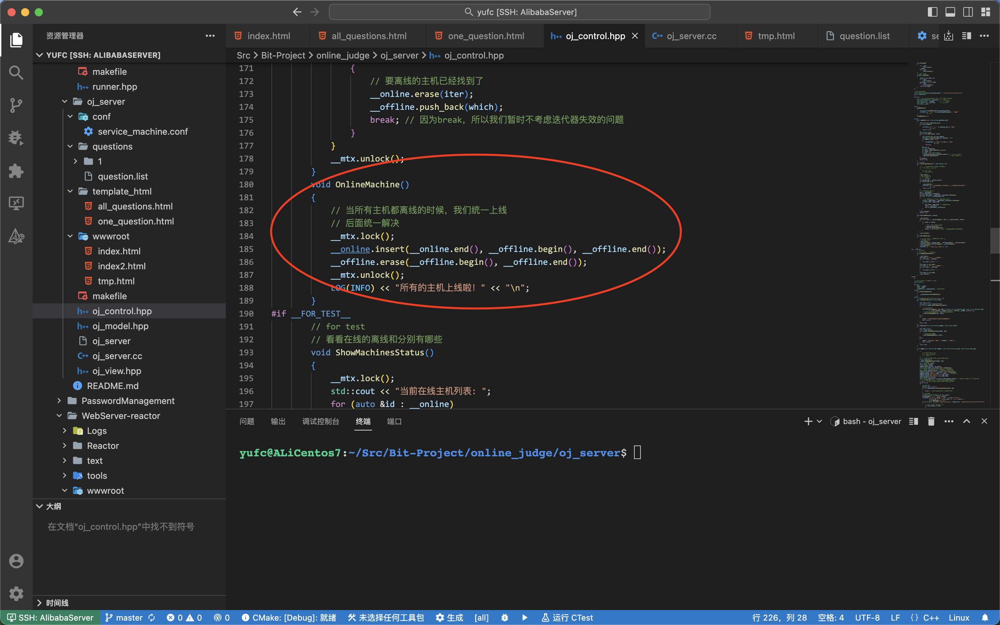

After all hosts go down, first restart all CR modules.

On the oj_server side, press ^C to bring all hosts back online!

Actually, let's change it to ^/ (using signal 3 instead), the current one is not very convenient.

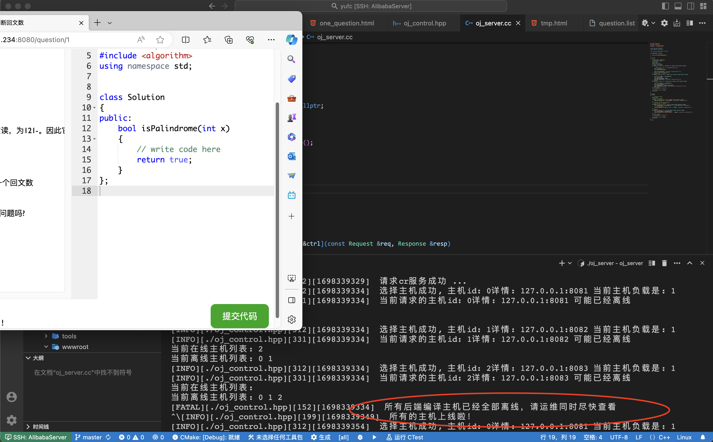

## 17. Project Completion

### 17.1 Project Extension Ideas

1. Registration and login-based problem submission functionality
2. Business expansion — integrate your own blog into it
3. Deploy the compilation service on Docker
4. Currently the backend CR service uses HTTP requests (just because of the request method). We could change it to remote procedure calls. Recommended: rest_rpc, to replace our httplib.
5. Feature improvement — after getting all test cases correct for a problem, automatically proceed to the next problem
6. All the features in the navbar can be implemented one by one

### 17.2 Overall Makefile Structure

```makefile
.PHONY:all
all:
	@cd compile_server;\
	make;\
	cd ..;\
	cd oj_server;\
	make;\
	cd ..;\


.PHONY:make_output
make_output:
	mkdir -p make_output/compile_server;\
	mkdir -p make_output/oj_server;\
	cp -rf ./compile_server/compile_server make_output/compile_server/;\
	cp -rf ./compile_server/temp make_output/compile_server/;\
	cp -rf ./oj_server/conf make_output/oj_server/;\
	cp -rf ./oj_server/questions make_output/oj_server/;\
	cp -rf ./oj_server/template_html make_output/oj_server/;\
	cp -rf ./oj_server/wwwroot make_output/oj_server/;\
	cp -rf ./oj_server/oj_server make_output/oj_server/;\


.PHONY:clean
clean:
	@cd compile_server;\
	make clean;\
	cd ..;\
	cd oj_server;\
	make clean;\
	cd ..;\
	rm -rf make_output
```

The make_output directory contains the content to be published.
